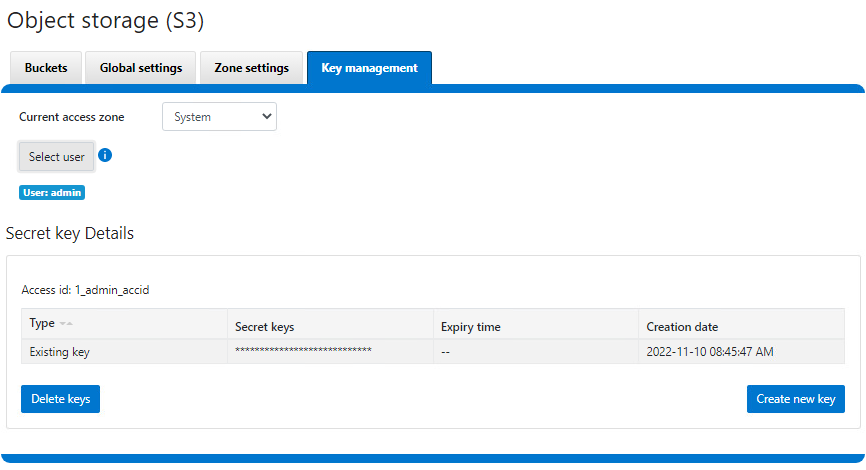

# Velero backup to PowerScale S3 Bucket

[Velero](https://velero.io/) is one of the most popular tools for backup and restoring of Kubernetes resources.

[PowerScale](https://www.dell.com/en-us/dt/storage/powerscale.htm) is Dell's leading scale-out NAS solution, supporting many different access protocols including S3!

<!-- more -->

## Velero backup options

You can use Velero for different backup options:

1. Protect Kubernetes resource objects like `Pod`, `Namespace`, etc.
2. Protect `PersistentVolume` data with `VolumeSnapshot`
3. Protect the content of PVs with [restic](https://restic.net/)

In all cases, Velero syncs the information to an object storage.

!!! note
    PowerScale is not 100% compatible with S3 protocol per AWS. Nonetheless, Velero doesn't use the unsupported calls, making PowerScale S3 a production-grade solution with Velero.

## Deployment

### PowerScale S3 configuration

1. Make sure S3 protocol is enabled:

```bash
PS1-1% isi s3 settings global view
         HTTP Port: 9020
        HTTPS Port: 9021
        HTTPS only: No
S3 Service Enabled: Yes
```


2. Create a bucket with write permissions


3. Create a key for the user - note that the key is only displayed upon creation



### Velero installation

1. Create credentials file:

```ini
[default]
aws_access_key_id = 1_admin_accid
aws_secret_access_key = 0sncWaAsVWycj4LFTPnxi2k8RPdi
```

2. Optionally, obtain the PowerScale SSL certificate for HTTPS

3. Install Velero:

```bash
velero install \
    --provider aws \
    --plugins velero/velero-plugin-for-aws:v1.5.1 \
    --bucket velero-backup \
    --secret-file ./credentials-velero \
    --use-volume-snapshots=false \
    --cacert ./ps2-cacert.pem \
    --backup-location-config region=powerscale,s3ForcePathStyle="true",s3Url=https://192.168.1.21:9021
```

For snapshot support with Dell CSI drivers:

```bash
velero install \
    --features=EnableCSI \
    --plugins=velero/velero-plugin-for-aws:v1.5.1,velero/velero-plugin-for-csi:v0.3.0 \
    --use-volume-snapshots=true
    ...
```

After installation, verify with `kubectl logs -n velero deployment/velero`.

You can check the actual content directly from PowerScale File Explorer:


## Demo

<iframe height="560" src="https://www.youtube.com/embed/6egsCR2aEQU" frameborder="0" allow="accelerometer; autoplay; encrypted-media; gyroscope; picture-in-picture" allowfullscreen></iframe>

## Conclusion

For small and easy protection of Kubernetes clusters, Velero & PowerScale S3 are a perfect duo. For broader features, consider [PowerProtect Data Manager](https://www.dell.com/en-us/dt/data-protection/powerprotect-data-manager.htm).

## References

* [Dell PowerScale OneFS S3 Overview](https://www.delltechnologies.com/asset/en-us/products/storage/industry-market/h18292-dell-emc-powerscale-onefs-s3-overview.pdf)
* [https://velero.io/](https://velero.io/)
