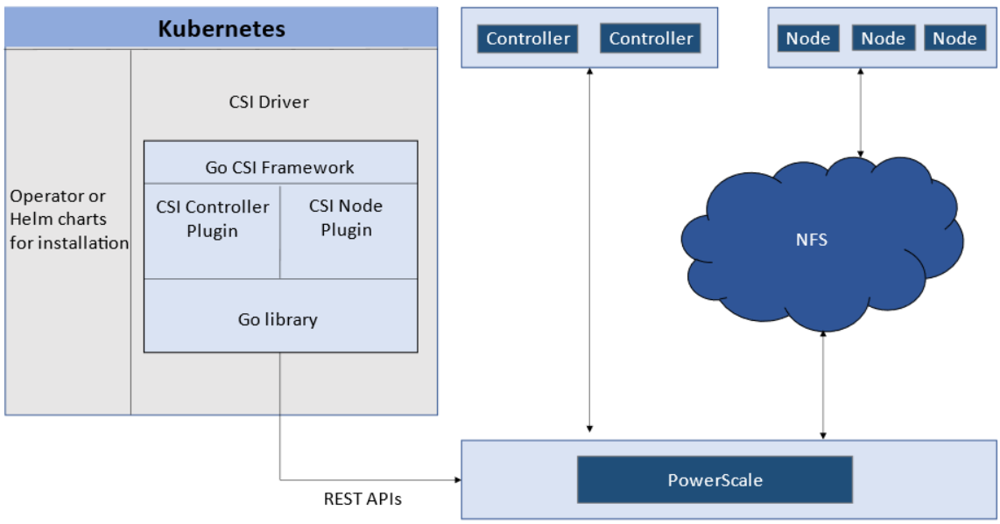
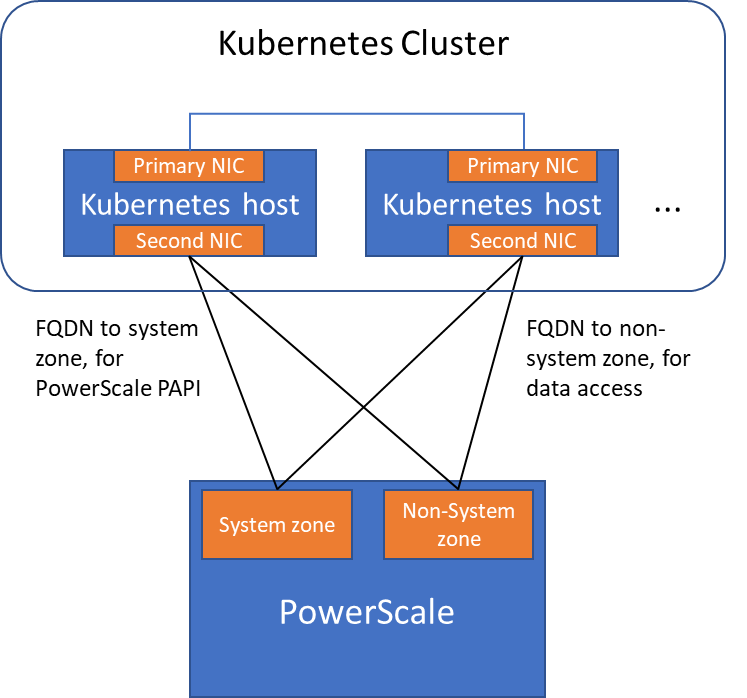

# Network Design for PowerScale CSI

*Co-authored with Sean Zhan.*

Network connectivity is an essential part of any infrastructure architecture. When it comes to how Kubernetes connects to PowerScale, there are several options to configure the Container Storage Interface (CSI). This post covers the concepts and configuration you can implement.

<!-- more -->

---

## CSI Plugins

Like all other Dell storage CSI drivers, PowerScale CSI follows the Kubernetes CSI standard by implementing functions in two components :

- **CSI controller plugin** : deployed as a Kubernetes Deployment (typically 2-3 replicas for HA, one leader). Communicates with PowerScale via Platform API to manage volumes (create/delete directories, NFS exports, quotas), update NFS client lists when pods move, etc.
- **CSI node plugin** : a Kubernetes DaemonSet running on all nodes by default. Mounts the NFS export from PowerScale and maps it to pods as persistent storage.



*CSI controller (Deployment) and node (DaemonSet) plugin architecture.*

---

## Roles, Privileges, and Access Zones

Because CSI needs to access both PAPI (PowerScale Platform API) and NFS data, a single user role typically is not secure enough. The role for PAPI access requires more privileges than normal users.

According to the [PowerScale CSI manual :simple-dell:](https://dell.github.io/csm-docs/docs/deployment/helm/drivers/installation/isilon/), CSI requires a user with the following privileges :

| Privilege | Type |
|-----------|------|
| `ISI_PRIV_LOGIN_PAPI` | Read Only |
| `ISI_PRIV_NFS` | Read Write |
| `ISI_PRIV_QUOTA` | Read Write |
| `ISI_PRIV_SNAPSHOT` | Read Write |
| `ISI_PRIV_IFS_RESTORE` | Read Only |
| `ISI_PRIV_NS_IFS_ACCESS` | Read Only |
| `ISI_PRIV_IFS_BACKUP` | Read Only |

Among these, `ISI_PRIV_SNAPSHOT` and `ISI_PRIV_QUOTA` are only available in the **System zone**. To fully utilize snapshot, clone, and capacity management features, CSI must access the PowerScale System zone. If you enable CSM for replication, the user also needs `ISI_PRIV_SYNCIQ` (also a System-zone privilege).

By contrast, there is no specific role requirement for data access : NFS handles it. As long as applications have the right ACL, they are good. For data access, a non-system zone is suitable and recommended.

These two access zones are defined in different places :

- **PAPI access zone** : set as `endpoint` in the secret YAML (e.g., `f200.isilon.com`)
- **Data access zone** : set as `AzServiceIP` in the StorageClass YAML (e.g., `openshift-data.isilon.com`)

!!! note "No System zone exposure?"
    If an admin cannot expose the System zone to the Kubernetes cluster, they must disable snapshot and quota features in the CSI installation configuration (`values.yaml`). The PAPI access zone can then be a non-System access zone.


*Kubernetes cluster connecting to PowerScale access zones : System zone for PAPI, non-System zone for data.*

---

## Network

A Kubernetes cluster comes with many networks : pod inter-communication, cluster service, etc. The PowerScale network does not have to join any of them. CSI pods can access a host's network directly, without going through Kubernetes internal networking. This also provides a dedicated high-performance network for data transfer.

**Example :** a Kubernetes host has two NICs :

- `192.168.1.x` : used for Kubernetes, aligned with the hostname
- `172.24.1.x` : not managed by Kubernetes, used for PowerScale data transfer

By default, the CSI driver uses the IP aligned with the hostname. To use the second NIC, set the IP range in `allowedNetworks` in the driver `values.yaml` :

```yaml
allowedNetworks: [172.24.1.0/24]
```

In this configuration, the Kubernetes internal DNS likely cannot resolve the PowerScale FQDN. Set `dnsPolicy` to `ClusterFirstWithHostNet` in `values.yaml`. This makes CSI pods use the DNS server from `/etc/resolv.conf` on the host OS instead of the Kubernetes internal DNS.



*Network configuration with `allowedNetworks` : data traffic on the dedicated NIC, PAPI on the primary NIC.*

!!! tip "allowedNetworks scope"
    The `allowedNetworks` setting only affects the data access zone, not the PAPI access zone. CSI uses this parameter to decide which host IP should be set as the NFS client IP on the PowerScale side. Network routing follows the OS route configuration.

## Sources

- [PowerScale CSI deployment guide :simple-dell:](https://dell.github.io/csm-docs/docs/deployment/helm/drivers/installation/isilon/)
- [Original article on Dell InfoHub :simple-dell:](https://infohub.delltechnologies.com/en-us/p/network-design-for-powerscale-csi-2/)
