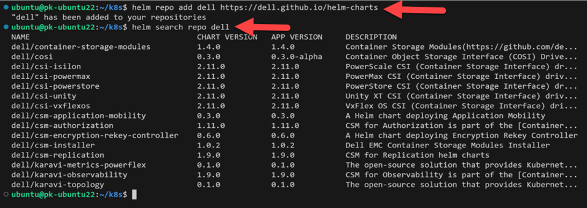
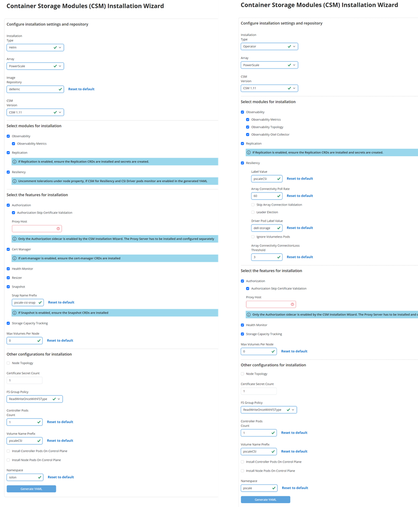
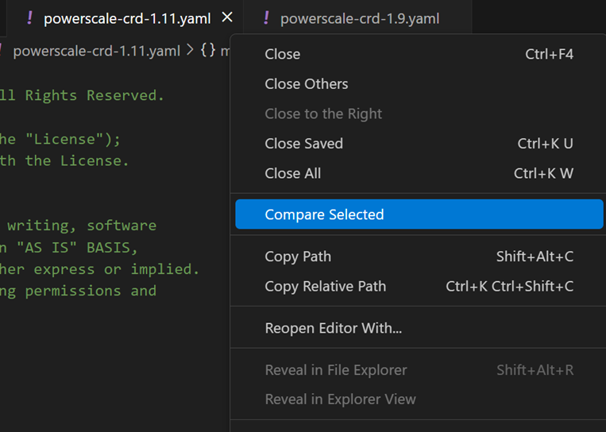
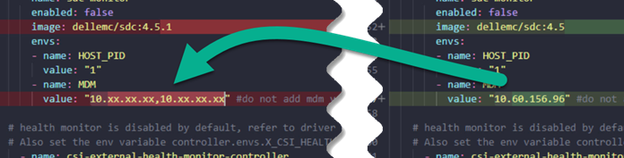
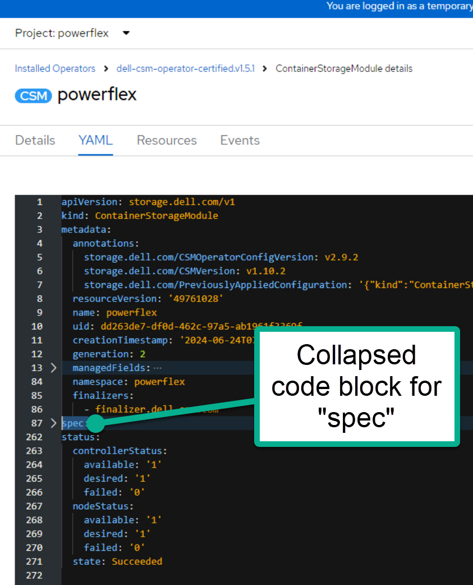

# Best Practices for Deployment and Life Cycle Management of Dell CSM Modules

*Co-authored with Parasar Kodati.*

The Dell CSM Kubernetes Operator packages the CSI driver and other storage services (Container Storage Modules) for observability, replication, authorization, and node resiliency. This single operator supports PowerFlex, PowerStore, PowerScale, and Unity platforms (see [Support Matrix :simple-dell:](https://dell.github.io/csm-docs/docs/deployment/csmoperator/)). This post lays out best practices for deployment and lifecycle management of Dell CSMs.

<!-- more -->

---

## Use Helm Charts Where You Can

Kubernetes operators provide a framework where the controller-CRD model can be extended for any functionality. However, for day-one deployment and upgrades, Helm charts provide a simpler solution. If you prefer not to use the Operator framework on platforms like [Red Hat OpenShift :simple-redhat:](https://www.redhat.com/en/technologies/cloud-computing/openshift), we recommend using Helm charts to install the CSMs.

Add the Helm repository for Dell and list the available charts :



*Dell Helm repository listing CSI drivers and CSM charts.*

### Use the Installation Wizard

Whether you use Helm Charts or the CSM Operator, the [CSM Installation Wizard :simple-dell:](https://dell.github.io/csm-docs/docs/deployment/csminstallationwizard/src/index.html) is an essential deployment tool. It provides a simple web interface to create YAML manifests. Select the method of installation (Operator or Helm), the Dell storage platform, and specify features and attributes :



*The CSM Installation Wizard generates configuration YAML for both Helm and Operator deployments.*

When you select Helm, the generated YAML contains all attributes for the Helm chart installation. When you select Operator, you generate the CRD that the Operator uses to install the CSMs :


*Side-by-side comparison of Helm values (left) and Operator CRD (right).*

### Store Configuration in a Versioning System

!!! warning "Most important step"
    After the YAML files are generated (and possibly modified) and used to install, they **must** be saved in a version control system.

This is critical during upgrades when you need to compare against a later install manifest. An integrated option is to use a GitOps agent to store the installation files and apply them. Examples :

- [Azure ARC/FluxCD :material-open-in-new:](https://infohub.delltechnologies.com/en-us/p/dell-container-storage-modules-a-gitops-ready-platform/)
- [ArgoCD :simple-argo:](https://infohub.delltechnologies.com/en-us/l/videos-131/argocd-deployment-of-stateful-application-dell-powerflex-container-storage-services-1/)

---

## Upgrades with Helm

CSI and CSM upgrades are straightforward with Helm charts. Use the wizard to generate the Helm manifest for the target version, then run `helm upgrade` with the new manifest.

You can enable or disable new modules, but you must carry over your customizations. For example, if you changed the default volume prefix, update it again in the new manifest.

Compare the new manifest with the one used during installation. At the CLI, use [git diff :material-open-in-new:](https://www.freecodecamp.org/news/git-diff-command/). Visual Studio Code has a [built-in compare tool :material-open-in-new:](https://devblogs.microsoft.com/visualstudio/new-in-visual-studio-compare-files-with-solution-explorer/) for a GUI approach.

---

## Upgrades with Operator

In the Operator framework, the Operator itself must be updated first. Each Operator version supports three versions of the CSMs (n, n-1, n-2). Check the [dell/csm-operator :material-github:](https://github.com/dell/csm-operator) samples folder for the list of CRD versions per storage platform :


*The samples folder in csm-operator shows supported CRD versions for each platform.*

Once you upgrade the Operator (either manually or through auto-upgrade in OpenShift), configure the latest CRD :

**Step 1 :** Generate the CRD using the wizard. It helps to remember the options you selected during the initial installation.

**Step 2 :** Compare the latest CRD with the original. Use git diff or VS Code :



*Comparing old and new CRDs in VS Code to identify changes.*

**Step 3 :** Reconcile changes in the new CRD. Version number differences are expected. However, environment-specific and feature selections must be carried over :

- **Terminology changes** (less probable) :


*Field names may change between versions.*

- **Environment details** :



*Endpoints, credentials, and storage identifiers must be preserved.*

- **Features and attributes** :


*Feature toggles selected in the wizard need to be carried forward.*

### Apply the New CRD

**Red Hat OpenShift GUI :**

1. Navigate to the CRD YAML section
2. Copy the new YAML file contents
3. Replace the **spec** section of the CRD (not the metadata section)
4. Save. The Operator picks up the latest CRD and updates the CSMs.



*Replacing the spec section in the OpenShift CRD editor.*

**kubectl CLI :**

```bash
kubectl delete ContainerStorageModule <name>
kubectl create -f new_CRD.yaml
```

---

## Conclusion

We hope this post helps you make your CSM upgrades smoothly. For questions or assistance, reach out to the community on [GitHub :material-github:](https://github.com/dell/csm/issues/) or [Slack :simple-slack:](https://dell.enterprise.slack.com/archives/C025E763URH).

## Sources

- [Dell CSM Operator documentation :simple-dell:](https://dell.github.io/csm-docs/docs/deployment/csmoperator/)
- [CSM Installation Wizard :simple-dell:](https://dell.github.io/csm-docs/docs/deployment/csminstallationwizard/src/index.html)
- [Original article on Dell InfoHub :simple-dell:](https://infohub.delltechnologies.com/en-us/p/best-practices-for-deployment-and-life-cycle-management-of-dell-csm-modules/)
