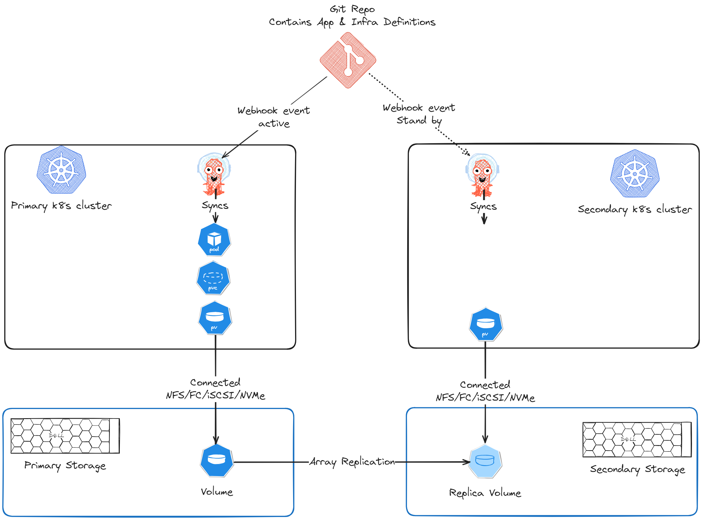

# 🌩️🛟 Disaster Recovery for VMs on Kubernetes

**Author(s):** Pooja Prasannakumar & Florian Coulombel

Kubernetes is no longer just a container orchestrator. As organizations modernize infrastructure, there’s growing interest in using Kubernetes to manage **virtual machines (VMs)** alongside cloud-native workloads—while still meeting familiar expectations like **disaster recovery (DR)**.

In this post, we’ll walk through a practical, GitOps-friendly DR approach for VMs running on Kubernetes using:

- **KubeVirt** to run VMs on Kubernetes
- **Dell Container Storage Modules (CSM)** for storage and replication
- **CSM Replication** to replicate VM disks across clusters
- **Argo CD + Kustomize** to manage deployment and failover via GitOps
<!-- more -->

---

## Introduction

The world of virtualization is undergoing a major shift. In recent years we’ve seen vendor consolidation (e.g., Broadcom acquiring VMware), the continued rise of cloud-native and serverless workloads, and broader adoption of alternative hypervisors.

That market context is pushing organizations to re-evaluate traditional VM management. One approach that has gained traction is **running VMs on Kubernetes** to benefit from Kubernetes’ ecosystem, automation, and resilience.

The **[KubeVirt](https://kubevirt.io/)** project enables VM-based workloads to run alongside containers in Kubernetes. This shared environment can be especially valuable for organizations adopting Kubernetes while still carrying VM-based workloads that cannot easily be containerized.

If you’re new to KubeVirt, the high-level concepts are explained in this lightboard video: **[KubeVirt overview (YouTube)](https://www.youtube.com/watch?v=JniNepFJHLs&list=PL2nlzNk2-VMEGtGMeUVkwAD2KcA4g8Q9k)**.

On the storage side, **[Dell Container Storage Modules](https://www.youtube.com/watch?v=OBlb25Kw20Q&list=PL2nlzNk2-VMHsKVguetbetbmxd4eMfc_X)** :simple-youtube: (CSM) simplify day-2 storage operations for Kubernetes workloads. In this post, we focus on how to **provision, protect, and recover** storage for VMs on Kubernetes using Dell CSM.

---

## GitOps Disaster Recovery (DR)

Disaster recovery for an application typically means restoring:

- **the application runtime** (in our case, a VM)
- **its configuration**
- **its data**

Many mature Kubernetes teams use **GitOps** to manage infrastructure and application configuration. With GitOps, the desired state of the system lives in Git, and the platform reconciles the real cluster state toward what’s declared in the repository.

Tools like **[Argo CD](https://argoproj.github.io/cd/)** :simple-argo: continuously apply changes from Git repositories to the target clusters. In this model, a DR event can be handled by a controlled change in Git (often a pull request) to move the workload from one site/cluster to another.

In the approach below:

- VM manifests are deployable to **either** cluster
- The VM disk is replicated from primary to secondary via **CSM Replication**
- A failover is driven by **storage replication failover** + **GitOps changes**

---

## Configure Two Kubernetes Clusters for CSM Replication

**[CSM Replication](https://dell.github.io/csm-docs/docs/replication/)** :simple-dell: brings array-based replication and DR workflows to Kubernetes clusters.

At a high level, you will:

1. Configure a **pair of storage arrays** for replication.
2. Configure the **CSI driver**:
   - Primary cluster CSI driver communicates with the **primary array**
   - Secondary cluster CSI driver communicates with the **secondary array**
3. Install **CSM Replication** on both clusters.
4. Configure **replicated StorageClasses** on both clusters:
   - `csi-replicated-sc` on the primary cluster
   - a matching replicated StorageClass on the secondary cluster

---

## Configure Argo CD to Deploy the VM to Both Clusters

The VM-based application should be deployable via Argo CD to either cluster. Common approaches for environment-specific overrides are **Helm values** :simple-helm: or **Kustomize overlays** :simple-kubernetes:.

In this example, we use **[Kustomize](https://kubectl.docs.kubernetes.io/guides/)** :simple-kubernetes: to manage cluster-specific differences.

### Prepare the application repo (Kustomize overlays)

In your Git repository, create separate overlays for primary and secondary clusters.

Example references (used in the lab repo):

- Primary overlay:
  - **[primary/kustomization.yaml](https://github.com/kumarp20/gitops-sample/blob/main/applicationsets/demo-vm/kustomize/primary/kustomization.yaml)** :simple-github:
- Secondary overlay:
  - **[secondary/kustomization.yaml](https://github.com/kumarp20/gitops-sample/blob/main/applicationsets/demo-vm/kustomize/secondary/kustomization.yaml)** :simple-github:

In the **primary** overlay:

- Use the replication **source** StorageClass (`csi-replicated-sc`) for the VM disk PVC.
- If the VM disk image needs to be pre-populated, add CDI annotations on the PVC to define the source image.
- Patch the VM `running` field to `true`.

In the **secondary** overlay:

- Patch the PVC to remove CDI annotations.
- Patch the VM `running` field to `false`.

> Tip: Keeping the VM defined on both clusters—but only running on one—sets you up for fast failover.

---

## Configure Argo CD (ApplicationSet)

1. Register both clusters with Argo CD.
2. Create an **ApplicationSet** for the VM.
3. Use a **list generator** to deploy the VM to both clusters as destinations.

A complete example is available here:

- **[applicationset-demo-vm.yaml](https://github.com/kumarp20/gitops-sample/blob/main/applicationsets/demo-vm/applicationset-demo-vm.yaml)** :simple-github:

This ApplicationSet will create:

- One Argo CD Application targeting the **primary** cluster
- One Argo CD Application targeting the **secondary** cluster

After syncing:

- The VM should be **Running** on the primary cluster
- The primary volume should be replicated to the secondary array
- The secondary cluster should have a **read-only** PV corresponding to the replica volume

<iframe width="560" height="315" src="https://www.youtube.com/embed/Fj6UC-TYIEQ?si=tQQKx64ioDnkPlLY" title="Argo CD UI sync + two apps" frameborder="0" allow="accelerometer; autoplay; clipboard-write; encrypted-media; gyroscope; picture-in-picture; web-share" referrerpolicy="strict-origin-when-cross-origin" allowfullscreen></iframe>

---

## Disaster Recovery (Failover)

If the primary cluster loses connectivity to the primary array—or if the primary site is impacted by a disaster—you can recover on the secondary site.

The failover has two parts:

1. **Fail over the storage replication** so the replica becomes writable.
2. **Flip the GitOps desired state** so the VM stops on primary and starts on secondary.

### 1) Initiate failover using CSM Replication

Initiate a failover using either:

- the `repctl` CLI, or
- by editing the `DellCSIReplicationGroup` object for the volume

The official DR procedure is documented here:

- **[CSM Replication Disaster Recovery](https://dell.github.io/csm-docs/docs/replication/disaster-recovery/)** :simple-dell:

After the failover:

- The PV on the secondary cluster switches from **ReadOnly** to **ReadWrite**.

### 2) Update GitOps overlays (PR-driven failover)

Next, update the repo so:

- Primary overlay sets VM `running: false`
- Secondary overlay sets VM `running: true`

A concrete PR example:

- **[Failover PR example](https://github.com/kumarp20/gitops-sample/pull/4/files)** :simple-github:

Additionally, update the secondary PVC to point to the replica PV by changing the `volumeName` attribute appropriately.

Once Argo CD syncs the updated state:

- The VM is stopped on primary
- The VM starts on secondary
- The VM disk uses the replica volume
- Data written before the disaster is retained after recovery

<iframe width="560" height="315" src="https://www.youtube.com/embed/VCM7UwBE96g?si=kfzRErGJE7vZx8aU" title="YouTube video player" frameborder="0" allow="accelerometer; autoplay; clipboard-write; encrypted-media; gyroscope; picture-in-picture; web-share" referrerpolicy="strict-origin-when-cross-origin" allowfullscreen></iframe>

---

## Conclusion

Running VMs on Kubernetes offers a compelling set of benefits:

- A shared platform for VM and cloud-native workloads
- GitOps workflows for consistent operations
- Multi-cluster and multi-site architectures

At the same time, virtualization has decades of established operational patterns, and these need to be adapted thoughtfully to Kubernetes.

In this post we focused on **disaster recovery** for KubeVirt-based VMs using **CSM Replication** and **Argo CD**. There’s much more to explore around networking, backups, data protection, and operational visibility.

Stay tuned for more content about KubeVirt 🤖☁️💻