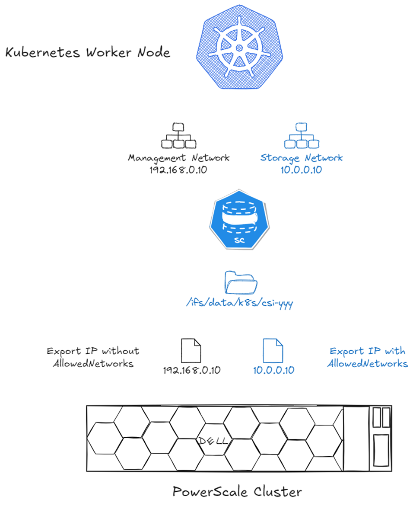

# Enable Storage Multi-tenancy on Kubernetes with PowerScale

Dell PowerScale is a scale-out NAS solution designed for high-performance, enterprise-grade file storage and **multi-tenant environments**. In multi-tenant environments, such as shared Kubernetes clusters, isolating workloads and data access is critical.

PowerScale addresses this need through **Access Zones**, which logically partition the cluster to enforce authentication boundaries, export rules, and quota policies. The Dell CSI driver maps Kubernetes StorageClass resources to specific Access Zones, providing per-tenant isolation at the storage layer.

This setup is particularly useful when multiple teams share a common PowerScale backend but require strict separation of data and access controls. This approach proved extremely valuable when building a GPU-as-a-Service [AI Factory :simple-nvidia:](https://www.dell.com/en-us/lp/dt/nvidia-ai).

<!-- more -->

---

## Access Zone Concepts

An **Access Zone** is an isolated space in PowerScale. It typically includes :

- A dedicated directory (e.g., `/ifs/data/legal`)
- A quota on that directory
- A network VLAN/IP pool
- DNS domain and LDAP configuration

For best practices on managing Access Zones, refer to the [official documentation :simple-dell:](https://www.dell.com/support/manuals/en-us/isilon-onefs/ifs-pub-91200-administration-guide-cli/access-zones?guid=guid-8a96772b-2329-4a5c-ad79-b6c1bb4173ea&lang=en-us).

---

## One Management Network, One Storage Network

In CSM versions prior to v1.15, support for separate management and storage networks was configurable through a global parameter named [`allowedNetworks` :material-github:](https://github.com/dell/helm-charts/blob/5c519815af7a005e5e9fd0c295d6fb779252a426/charts/csi-isilon/values.yaml#L51). This parameter accepts a list of CIDR entries to select the relevant IP for the node.

**Example :** a Kubernetes node has two NICs :

- Management Network : `192.168.0.10`
- Storage Network : `10.0.0.10`

If `allowedNetworks` is set to `192.168.0.0/24`, all Kubernetes nodes on that network will publish their IP address on the export.

In a Helm deployment :

```yaml
allowedNetworks: [192.168.0.0/24]
```

In an Operator deployment :

```yaml
apiVersion: storage.dell.com/v1
kind: ContainerStorageModule
metadata:
  name: isilon
spec:
  driver:
    csiDriverType: "isilon"
    # ...
    node:
      envs:
        - name: X_CSI_ALLOWED_NETWORKS
          value: "[192.168.0.0/24]"
```

Then configure the StorageClass :

```yaml
apiVersion: storage.k8s.io/v1
kind: StorageClass
metadata:
  name: powerscale
provisioner: csi-isilon.dellemc.com
reclaimPolicy: Delete
allowVolumeExpansion: true
parameters:
  AccessZone: legal
  IsiPath: /ifs/data/legal
  AzServiceIP: legal.example.com
volumeBindingMode: Immediate
```

!!! tip "`AzServiceIP` should be a DNS name"
    Despite its name, `AzServiceIP` can and should be a DNS name for accessing the Access Zone.

The following diagram shows the results without `allowedNetworks` (black) and with it (blue) :



*IP selection with `allowedNetworks` : only the matching CIDR IP is published on the NFS export.*

---

## Multiple Storage Networks and Access Zones

While `allowedNetworks` works well for a single Access Zone or dedicated nodes per Access Zone, it falls short when a Kubernetes node connects to multiple Access Zones.

CSM v1.15 introduced support for [multiple Access Zones and multi-tenant Kubernetes clusters :simple-dell:](https://dell.github.io/csm-docs/docs/concepts/csidriver/features/powerscale/#multi-access-zone-support-for-multi-tenant-deployments) using the `AzNetwork` parameter.

`AzNetwork` works similarly to `allowedNetworks` but is defined **per StorageClass**, allowing IP selection based on CIDR.

**Example :** a Kubernetes node connects to :

- Management Network : `192.168.0.10`
- Legal VLAN : `192.168.100.10`
- Engineering VLAN : `10.0.0.10`
- Marketing VLAN : `172.16.0.10`

This configuration requires three StorageClass definitions :

```yaml
---
apiVersion: storage.k8s.io/v1
kind: StorageClass
metadata:
  name: powerscale-legal
provisioner: csi-isilon.dellemc.com
reclaimPolicy: Delete
allowVolumeExpansion: true
parameters:
  AccessZone: legal
  AzServiceIP: legal.example.com
  AzNetwork: 192.168.100.0/24
---
apiVersion: storage.k8s.io/v1
kind: StorageClass
metadata:
  name: powerscale-engineering
provisioner: csi-isilon.dellemc.com
reclaimPolicy: Delete
allowVolumeExpansion: true
parameters:
  AccessZone: engineering
  AzServiceIP: engineering.example.com
  AzNetwork: 10.0.0.0/24
---
apiVersion: storage.k8s.io/v1
kind: StorageClass
metadata:
  name: powerscale-marketing
provisioner: csi-isilon.dellemc.com
reclaimPolicy: Delete
allowVolumeExpansion: true
parameters:
  AccessZone: marketing
  AzServiceIP: marketing.example.com
  AzNetwork: 172.16.0.0/24
```

The diagram below shows the results in the NFS export :


*Per-StorageClass IP selection with `AzNetwork` : each Access Zone export uses the correct VLAN IP.*

!!! tip "Greenfield recommendation"
    Even if you start with a single storage network, use `AzNetwork` from the beginning. It allows easier expansion to multiple Access Zones later.

---

## Digression on CSI Network Requirements

CSI drivers (including Dell's) consist of two components :

- [**Controller** :material-kubernetes:](https://kubernetes-csi.github.io/docs/deploying.html#controller-plugin) : handles Kubernetes calls such as create volume, expand volume, delete snapshots, etc.
- [**Node** :material-kubernetes:](https://kubernetes-csi.github.io/docs/deploying.html#node-plugin) : formats and mounts the volume

Network communication often simplifies as :


*Simplified CSI network communication : controller talks to the storage API, node handles data I/O.*

For Dell CSI drivers, the node plugin also checks endpoint health, requiring API communication from **all nodes** in the cluster :


*Dell CSI network communication : the node plugin requires API access for health checks, not just data I/O.*

If complete isolation is required (e.g., MSP environments), [CSM Authorization :simple-dell:](https://dell.github.io/csm-docs/docs/concepts/authorization/v2.x/) can help. Deploy CSM Authorization with connectivity to both networks : Kubernetes on the DMZ and PowerScale management.


*CSM Authorization acts as a proxy, isolating Kubernetes nodes from direct PowerScale management access.*

---

## Key Takeaways

- PowerScale Access Zones enable secure multi-tenancy in Kubernetes
- `allowedNetworks` controls IP selection for exports in single-zone setups
- `AzNetwork` allows per-StorageClass IP selection for multi-zone environments
- Dell CSI drivers require API access from all nodes for health checks
- CSM Authorization provides isolation for managed service providers

## Sources

- [PowerScale OneFS 9.12.0.0 CLI Administration Guide : Access zones :simple-dell:](https://www.dell.com/support/manuals/en-us/isilon-onefs/ifs-pub-91200-administration-guide-cli/access-zones?guid=guid-8a96772b-2329-4a5c-ad79-b6c1bb4173ea&lang=en-us)
- [CSI PowerScale : Multi-Access Zone support :simple-dell:](https://dell.github.io/csm-docs/docs/concepts/csidriver/features/powerscale/#multi-access-zone-support-for-multi-tenant-deployments)
- [Network Design for PowerScale CSI :simple-dell:](https://infohub.delltechnologies.com/en-us/p/network-design-for-powerscale-csi-2/)
- [Original article on Dell InfoHub :simple-dell:](https://infohub.delltechnologies.com/en-us/p/enable-storage-multi-tenancy-on-kubernetes-with-powerscale/)
