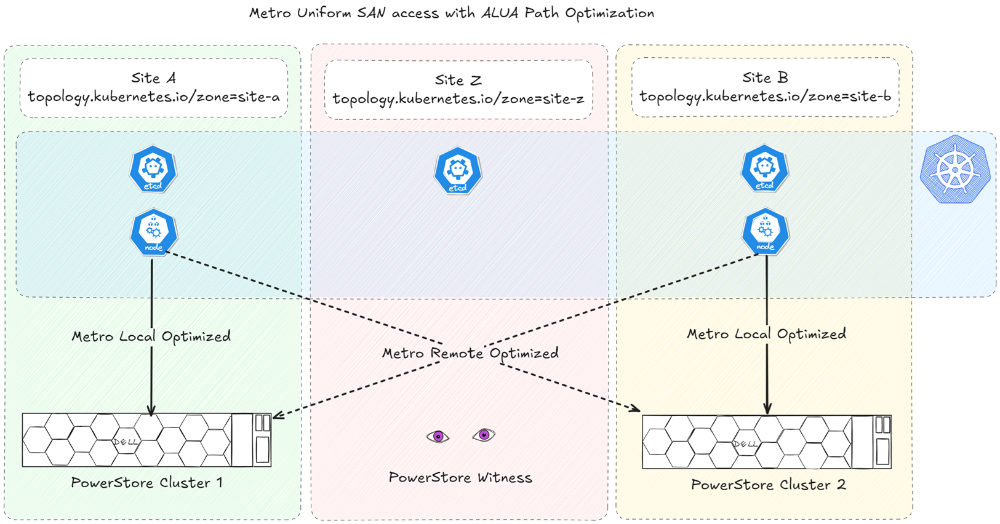

# PowerStore Metro + Dell CSI: What Matters for Kubernetes

PowerStore Metro enables active-active synchronous replication between two PowerStore clusters, delivering zero data loss ([RPO :material-open-in-new:](https://en.wikipedia.org/wiki/IT_disaster_recovery#Recovery_Point_Objective) 0) and continuous availability. Integrated with the Dell CSI driver, it brings high availability to Kubernetes applications that lack native HA by presenting a single Metro-replicated volume accessible from both sites.

<!-- more -->

---

## Architecture Overview

### Metro Volume Access

A Metro `PersistentVolume` can be presented to a Kubernetes worker node (`AccessMode: ReadWriteOnce`) or as a raw block device to multiple nodes (`AccessMode: ReadWriteMany`). This single logical volume must be accessible from both PowerStore clusters.

As of **CSM 1.15**, only **uniform SAN access** is supported. Each Kubernetes worker node must have access to both PowerStore clusters.

The Metro architecture targets zero data loss (RPO 0) and continuous availability, but its behavior depends on how connectivity and failover are configured.

### Why You Need a Witness

Without a witness, Metro failover decisions rely solely on the preferred role. For simple link failures, this works. For complex scenarios (simultaneous link and site issues), it can lead to [split-brain :material-open-in-new:](https://en.wikipedia.org/wiki/Split-brain_(computing)), data corruption, or unnecessary downtime.

The witness acts as a **tiebreaker** when the two PowerStore clusters lose contact with each other.

Similarly, in Kubernetes, distributing control-plane nodes across multiple failure domains is recommended to maintain quorum. This is often implemented as three sites with three instances of the core services, and even mandated in some [enterprise platforms like OpenShift :simple-redhat:](https://docs.redhat.com/en/documentation/openshift_container_platform/4.19/html/architecture/control-plane#defining-masters_control-plane).

PowerStore Witness is a lightweight service that can be [deployed with a simple .rpm package :simple-dell:](https://infohub.delltechnologies.com/en-us/l/dell-powerstore-metro-volume-1/requirements-and-installation-3/).

### Multipathing

Multipathing is **critical** in a Metro setup because a Metro volume is presented from **two arrays simultaneously**. Without multipath, the OS or Kubernetes node would detect multiple devices for the same volume. This can lead to data corruption or I/O errors.

Multipath consolidates these paths into a single logical device and ensures :

- **Path failover :** if one array or link fails, I/O automatically switches to the surviving path without disrupting applications.
- **Load balancing :** distributes I/O across available paths for better performance.

In a PowerStore Metro configuration, the recommended algorithm is **Round Robin** combined with **Asymmetric Logical Unit Access (ALUA)** for SCSI-based host access. ALUA allows the storage system to inform the host which paths are optimized and which are non-optimized, enabling intelligent path selection.

For iSCSI and Fibre Channel, configuration is handled through **Device Mapper Multipath (DM-Multipath)** on Linux.

---

## Metro Topologies

ALUA path optimization depends on how the hosts are registered in PowerStore. Since the CSI driver registers hosts automatically, it is important to configure the driver accordingly.

This is controlled through the Kubernetes well-known label [`topology.kubernetes.io/zone` :material-kubernetes:](https://kubernetes.io/docs/reference/labels-annotations-taints/#topologykubernetesiozone). The administrator applies the label to `Node` objects and defines the corresponding zone in the `powerstore-config` Secret.

To verify the node zone labels :

```bash
kubectl get nodes -o custom-columns='NAME:.metadata.name,ZONE:.metadata.labels.topology\.kubernetes\.io/zone'
```

The `powerstore-config` Secret looks like :

```yaml
arrays:
  - endpoint: "https://11.0.0.1/api/rest"
    globalID: "Cluster1"
    username: "user"
    password: "password"
    skipCertificateValidation: true
    blockProtocol: "FC"
    metroTopology: Uniform
    labels:
      topology.kubernetes.io/zone: site-a
  - endpoint: "https://11.0.0.2/api/rest"
    globalID: "Cluster2"
    username: "user"
    password: "password"
    skipCertificateValidation: true
    blockProtocol: "FC"
    metroTopology: Uniform
    labels:
      topology.kubernetes.io/zone: site-b
```

With two sites A and B, the ALUA paths are configured as follows :


*ALUA path optimization : paths to the local PowerStore cluster are optimized, paths to the remote cluster are non-optimized.*

!!! warning "Zone label is required"
    As of CSM 1.15, if a worker node lacks the zone label or the value differs from the ones defined in the `powerstore-config` Secret, it will not be registered for block storage consumption.

Below is the registration when all nodes and PowerStore clusters share the same `topology.kubernetes.io/zone` value :



*All nodes registered with the same zone see optimized paths to both clusters.*

If no topology zone is configured and the StorageClass has the parameter `replication.storage.dell.com/mode: "METRO"`, the CSI driver assumes local connectivity to both PowerStore clusters :


*Local connectivity mode (pre-v1.14 default). Recommended for testing only.*

!!! note "Testing only"
    The local connectivity configuration, while the only supported option in CSM pre-v1.14, is recommended for testing environments only.

---

## Conclusion

PowerStore Metro, combined with the Dell CSI driver, provides a robust foundation for **zero data loss** and **high availability** in Kubernetes environments. To achieve this :

- Ensure **uniform connectivity** and proper **multipath configuration**
- Deploy a **Metro Witness** for intelligent failover and split-brain prevention
- Configure **node topology labels** and the CSI driver correctly for predictable path optimization

When implemented properly, Metro enables Kubernetes workloads to survive site-level failures with minimal disruption.

## Sources

- [Dell PowerStore : Metro Volume :simple-dell:](https://infohub.delltechnologies.com/en-us/t/dell-powerstore-metro-volume-1/)
- [CSI PowerStore Metro :simple-dell:](https://dell.github.io/csm-docs/docs/concepts/replication/high-availability/powerstore-metro/)
- [Original article on Dell InfoHub :simple-dell:](https://infohub.delltechnologies.com/en-us/p/powerstore-metro-dell-csi-what-matters-for-kubernetes/)
