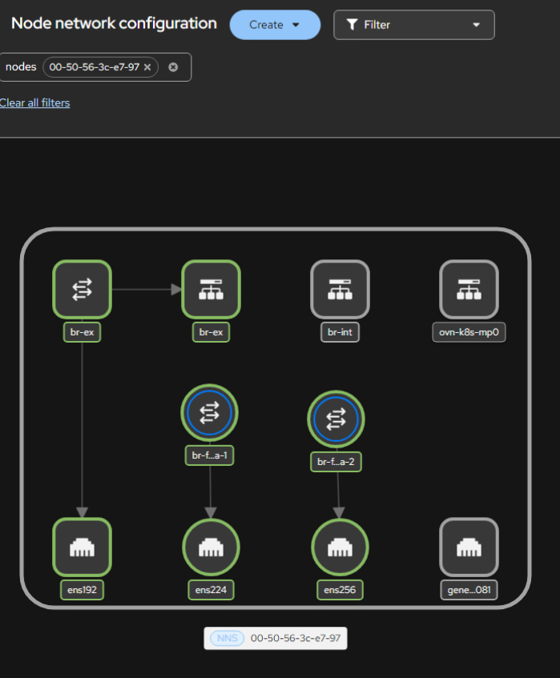
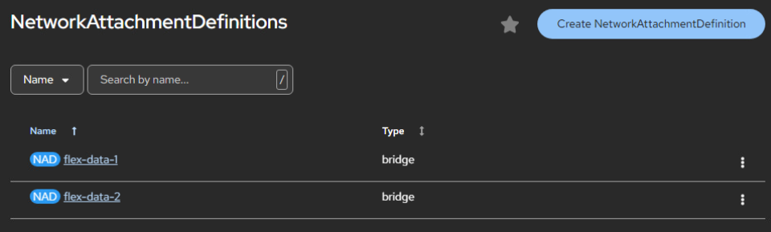

# CSI for PowerFlex on OpenShift with Multiple Networks

Managing multiple networks for storage workloads on OpenShift is not optional: it is essential for performance and isolation. Dell PowerFlex :simple-dell:, with its CSI driver, delivers dynamic storage provisioning, but multi-network setups require proper configuration.

This guide explains how to enable multi-network support for CSI PowerFlex on OpenShift, including prerequisites, network attachment definitions, and best practices for high availability.

<!-- more -->

---

## Software Data Client in the Worker Nodes

To ensure optimal performance and availability, PowerFlex utilizes a minimum of two data networks. The SDC (Software Data Client) natively handles multipathing, reducing the need to create `multipath.d` configurations. As administrators, we only need to provide two properly configured storage networks.

In this example, the OpenShift cluster nodes are connected to three networks:

- **Main network** for management and services
- **PowerFlex Data 1**
- **PowerFlex Data 2**

### Step 1: Install the NMState Operator

Install the [NMState Operator :simple-redhat:](https://docs.openshift.com/container-platform/latest/networking/k8s_nmstate/k8s-nmstate-about-the-k8s-nmstate-operator.html) from the OperatorHub. It is straightforward and only needs a couple of clicks. Once the NMState CR resource is created, proceed with network configuration.

### Step 2: Configure Data Network Interfaces

Using the NMState Operator, we configure the additional PowerFlex data network interfaces. The default NIC remains set by ignition configuration for the main network; NMState will manage the two data networks.

The following is an example configuration for one host (duplicate and update hostname and IPs for each host):

```yaml
apiVersion: nmstate.io/v1
kind: NodeNetworkConfigurationPolicy
metadata:
  name: 00-50-56-3c-e7-97
spec:
  nodeSelector:
    kubernetes.io/hostname: "00-50-56-3c-e7-97"
  desiredState:
    interfaces:
      - name: ens224
        type: ethernet
        state: up
        ipv4:
          dhcp: false
          address:
            - ip: 192.168.2.213
              prefix-length: 24
          enabled: true
        mtu: 9000 # Jumbo frames per PowerFlex requirement
      - name: ens256
        type: ethernet
        state: up
        ipv4:
          dhcp: false
          address:
            - ip: 192.168.3.213
              prefix-length: 24
          enabled: true
        mtu: 9000
    routes:
      config:
        - destination: 192.168.2.0/24
          next-hop-address: 192.168.2.1
          next-hop-interface: ens224
        - destination: 192.168.3.0/24
          next-hop-address: 192.168.3.1
          next-hop-interface: ens256
```

The **Networking > Node network configuration** UI provides a clear visualization of your setup:


*NMState node network configuration in the OpenShift console.*

NMState is feature-rich, enabling the creation and configuration of Bridge, Bonding, Virtual Routing and Forwarding, and more (see the [official documentation :simple-linux:](https://nmstate.io/examples.html) for more examples).

In OpenShift and other supported operating systems, the PowerFlex CSI driver has an SDC init-container which handles injecting the SDC binary into each worker. Once the NMState configurations have been applied and the init-container injects the SDC, it will be immediately visible in the PowerFlex UI.

---

## Software Data Client in OpenShift Virtualization VMs

To expose networks to Virtual Machines, it is mandatory to create Bridge devices mapped to these networks. In the following example, we use a `NodeNetworkConfigurationPolicy` to add bridge interfaces mapped to the physical network interfaces, and `NetworkAttachmentDefinition` resources to expose the networks to VM virtual interfaces.

```yaml
apiVersion: nmstate.io/v1
kind: NodeNetworkConfigurationPolicy
metadata:
  name: 00-50-56-3c-e7-97-bridges
spec:
  nodeSelector:
    kubernetes.io/hostname: "00-50-56-3c-e7-97"
  desiredState:
    interfaces:
      - name: ens224
        type: ethernet
        state: up
        mtu: 9000
        ipv4: { enabled: false } # No IPv4 or IPv6 on the host
        ipv6: { enabled: false } # The IP will be configured within the VM
        mac-address: "00:50:56:3c:e7:98" # Pin the MAC to prevent reindexing
      - name: ens256
        type: ethernet
        state: up
        mtu: 9000
        ipv4: { enabled: false }
        ipv6: { enabled: false }
        mac-address: "00:50:56:3c:e7:99"
      - name: br-flex-data-1
        type: linux-bridge
        state: up
        mtu: 9000
        ipv4: { enabled: false }
        ipv6: { enabled: false }
        bridge:
          options:
            stp:
              enabled: false
          port:
            - name: ens224
      - name: br-flex-data-2
        type: linux-bridge
        state: up
        mtu: 9000
        ipv4: { enabled: false }
        ipv6: { enabled: false }
        bridge:
          options:
            stp:
              enabled: false
          port:
            - name: ens256
```

Then create the `NetworkAttachmentDefinition` resources to expose the bridges to VMs:

```yaml
apiVersion: k8s.cni.cncf.io/v1
kind: NetworkAttachmentDefinition
metadata:
  name: flex-data-1
spec:
  config: |
    {
      "cniVersion": "0.4.0",
      "type": "bridge",
      "bridge": "br-flex-data-1",
      "hairpinMode": false,
      "mtu": 9000,
      "isDefaultGateway": false,
      "ipam": {
        "type": "whereabouts",
        "range": "192.168.2.0/24",
        "range_start": "192.168.2.200",
        "range_end": "192.168.2.250"
      }
    }
---
apiVersion: k8s.cni.cncf.io/v1
kind: NetworkAttachmentDefinition
metadata:
  name: flex-data-2
spec:
  config: |
    {
      "cniVersion": "0.4.0",
      "type": "bridge",
      "bridge": "br-flex-data-2",
      "hairpinMode": false,
      "mtu": 9000,
      "isDefaultGateway": false,
      "ipam": {
        "type": "whereabouts",
        "range": "192.168.3.0/24",
        "range_start": "192.168.3.200",
        "range_end": "192.168.3.250"
      }
    }
```

After the `NodeNetworkConfigurationPolicy` has rolled out successfully, the new bridges appear under the Node network configuration UI:



*Bridge interfaces (`br-flex-data-1` and `br-flex-data-2`) mapped to the PowerFlex data networks, visible in the OpenShift console after the `NodeNetworkConfigurationPolicy` rollout.*

The `NetworkAttachmentDefinition` resources are also visible under the Networking interface:


*NetworkAttachmentDefinitions for PowerFlex data networks.*

From the Virtual Machine, you can add the relevant network interfaces:


*Adding PowerFlex data network interfaces to a Virtual Machine.*

The last step is to install the SDC within the VM, for which you can refer to the [official guide :simple-dell:](https://www.dell.com/support/kbdoc/en-us/000223010/dell-powerflex-software-data-client-sdc-installation-guide).

---

## One More Thing: Cleanup

While testing different configurations, I noticed that despite removing all of the CRs, there were leftovers. To make sure all bridges and routes are properly deleted, use an explicit cleanup policy:

```yaml
apiVersion: nmstate.io/v1
kind: NodeNetworkConfigurationPolicy
metadata:
  name: cleanup-leftovers
spec:
  # nodeSelector removed → matches all nodes in the cluster
  desiredState:
    interfaces:
      - name: br-bond
        type: linux-bridge
        state: absent
      - name: br-bond.1
        type: vlan
        state: absent
      - name: br-bond.2
        type: vlan
        state: absent
      - name: bond1
        type: bond
        state: absent
    routes:
      config:
        - next-hop-interface: br-bond.2
          state: absent
        - next-hop-interface: br-bond.1
          state: absent
        - next-hop-interface: ens256
          state: absent
        - next-hop-interface: ens224
          state: absent
```

Et voila, clean and neat, just like the original deployment.

---

## Conclusion

The combined power of Network Manager and Kubernetes' reconciliation loop makes configuring and managing networks for PowerFlex on OpenShift straightforward. The resulting configurations are clean, reliable, and easy to troubleshoot.

## Sources

- [NMState Operator documentation :simple-redhat:](https://docs.openshift.com/container-platform/latest/networking/k8s_nmstate/k8s-nmstate-about-the-k8s-nmstate-operator.html)
- [NMState configuration examples :simple-linux:](https://nmstate.io/examples.html)
- [Dell CSI PowerFlex documentation :simple-dell:](https://dell.github.io/csm-docs/docs/csidriver/installation/helm/powerflex/)
- [PowerFlex SDC installation guide :simple-dell:](https://www.dell.com/support/kbdoc/en-us/000223010/dell-powerflex-software-data-client-sdc-installation-guide)
- [Original article on Dell InfoHub :simple-dell:](https://infohub.delltechnologies.com/en-us/p/csi-for-powerflex-on-openshift-with-multiple-networks/)
