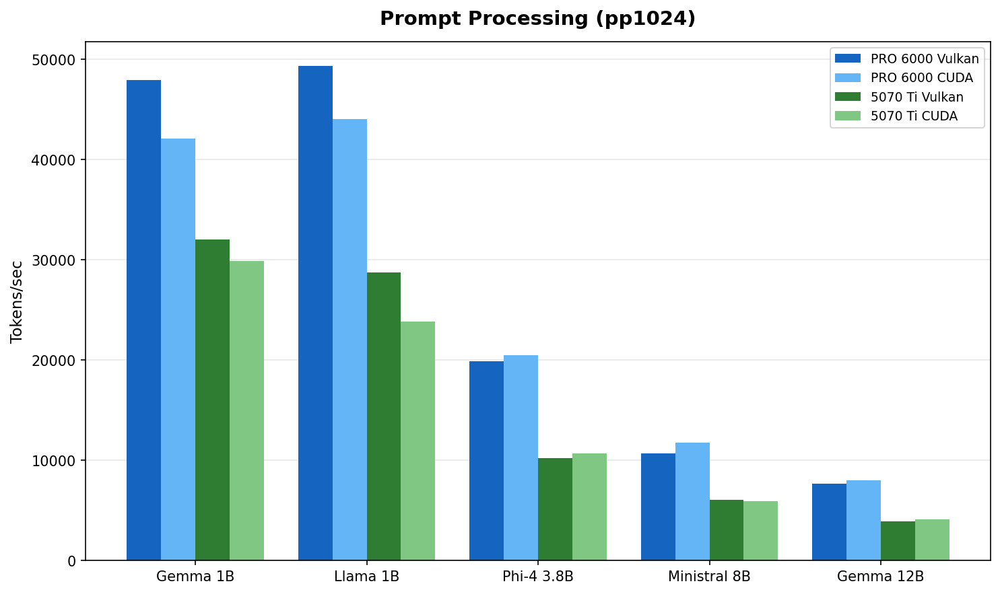
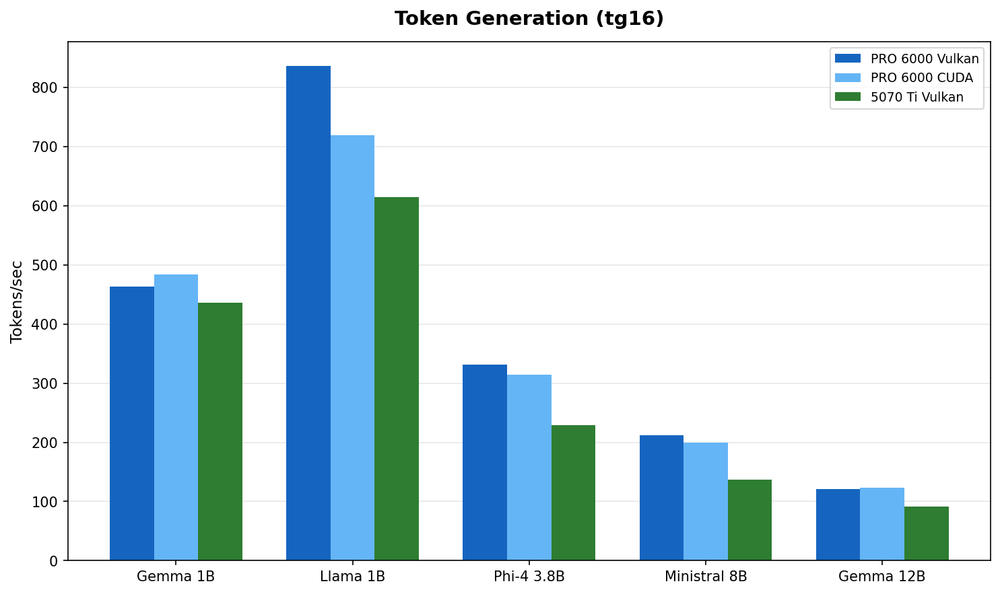
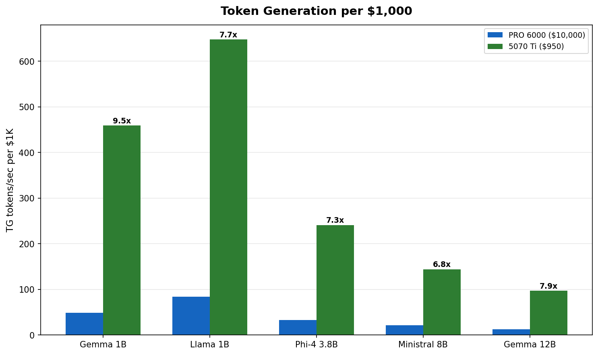
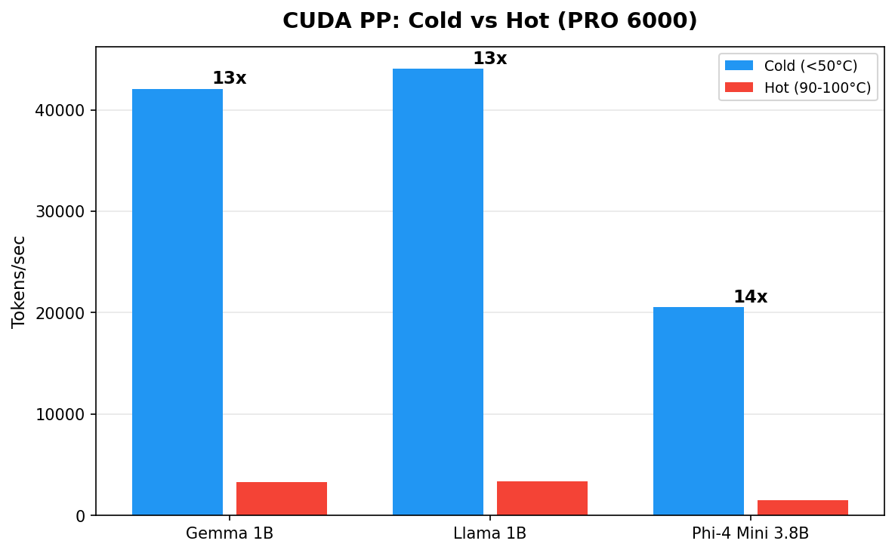

# Blackwell GPUs for Local LLMs : RTX PRO 6000 vs RTX 5070 Ti

## The Benchmark Nobody Asked For

*Tested on AMD Ryzen 7 9800X3D with llama.cpp b7966 via localscore-bench, February 2026*

---

## TL;DR

We benchmarked eight LLM models (1B to 70B parameters) on two Blackwell GPUs with Vulkan and CUDA 13.1, on both Linux and Windows.

**The headlines :**

- :material-cash-multiple: **The $950 card delivers 4 to 7x more tokens per dollar.** For models under 12B, the 5070 Ti is the rational choice.
- :material-scale-balance: **Vulkan and CUDA perform within 5 to 15% on cold hardware.** Pick whichever works for your setup.
- :material-snowflake: **The 5070 Ti just works. The PRO 6000 needs server cooling to get to its full potential.** Active fans vs passive heatsink is a real differentiator.
- :material-check-all: **OS barely matters.** Linux and Windows within 5 to 10%.
- :material-memory: **VRAM is the main reason to buy the PRO 6000.** It earns its price at 32B+, not at 12B.

<!-- more -->

---

## The Setup

{ width="600" }

*The Antec C5 mid-tower with seven case fans, doing its best to cool a 600W passive GPU.*

### GPU Specifications

| Spec | [RTX PRO 6000 SE :simple-nvidia:](https://www.nvidia.com/en-us/data-center/rtx-pro-6000-blackwell-server-edition/?ncid=no-ncid) | [RTX 5070 Ti :simple-nvidia:](https://www.nvidia.com/en-us/geforce/graphics-cards/50-series/rtx-5070-family/) |
|------|-----------------|-------------|
| Architecture | Blackwell (GB202) | Blackwell (GB203) |
| VRAM | 96 GB GDDR7 | 16 GB GDDR7 |
| Memory bandwidth | ~1,792 GB/s | ~896 GB/s |
| TDP | 600W (configurable 300-600W) | 300W |
| Cooling | Passive (no fans) | Active (dual/triple fan) |
| Target | Server / workstation rack | Consumer desktop |
| Street price (Feb 2026) | ~$10,000 | ~$950 |

### Test Bench

| Component | Detail |
|-----------|--------|
| CPU | AMD Ryzen 7 9800X3D |
| RAM | 60 GB DDR5 |
| OS | openSUSE Tumbleweed :simple-opensuse: + Windows 11 Pro :material-microsoft: (same hardware) |
| Engine | [llama.cpp :material-github:](https://github.com/ggml-org/llama.cpp) b7966 (Vulkan with coopmat2, CUDA 13.1) |
| Benchmark | [localscore-bench :material-github:](https://github.com/mozilla-ai/llamafile/tree/main/localscore) : pp1024+tg1024 primary config |

Both GPUs share Blackwell architecture and GDDR7 memory. The PRO 6000 has 6x the VRAM, 2x the memory bandwidth, 2x the power budget, and zero fans.

---

## The Results : PRO 6000 vs 5070 Ti

### Prompt Processing

*Fig 1 : Prompt processing throughput ([model selection rationale](#model-selection)). The PRO 6000 leads by 1.5 to 2x, matching its 2:1 memory bandwidth advantage.*

| Model | PRO 6000 Vulkan | PRO 6000 CUDA | 5070 Ti Vulkan | 5070 Ti CUDA | PRO 6000 lead |
|-------|-----------------|---------------|----------------|--------------|---------------|
| [Gemma 3 1B :simple-google:](https://huggingface.co/bartowski/google_gemma-3-1b-it-GGUF) | 47,925 | 42,075 | 32,064 | 29,862 | 1.5x |
| [Llama 3.2 1B :simple-meta:](https://huggingface.co/bartowski/Llama-3.2-1B-Instruct-GGUF) | 49,329 | 44,046 | 28,768 | 23,843 | 1.7x |
| [Phi-4 Mini 3.8B :simple-microsoft:](https://huggingface.co/bartowski/microsoft_Phi-4-mini-instruct-GGUF) | 19,917 | 20,525 | 10,212 | 10,705 | 1.9x |
| [Ministral 8B :material-creation-outline:](https://huggingface.co/bartowski/Ministral-8B-Instruct-2410-GGUF) | 10,692 | 11,780 | 6,041 | 5,901 | 1.8x |
| [Gemma 3 12B :simple-google:](https://huggingface.co/bartowski/google_gemma-3-12b-it-GGUF) | 7,668 | 8,040 | 3,950 | 4,127 | 1.9x |

> PP = Prompt Processing (tokens/sec). All models use [Q4_K_M quantization](#why-q4_k_m-quantization).

The PRO 6000's wider memory bus shows up clearly in prefill workloads. Prompt processing is memory bandwidth bound : the 2:1 bandwidth ratio (~1,792 vs ~896 GB/s) maps directly to the observed 1.5 to 2x performance gap.

### Token Generation

*Fig 2 : Token generation throughput. The gap narrows to 1.1 to 1.5x. Both cards are faster than anyone can read.*

| Model | PRO 6000 (best) | 5070 Ti (best) | PRO 6000 lead |
|-------|-----------------|----------------|---------------|
| Gemma 3 1B | 484 t/s | 436 t/s | 1.1x |
| Llama 3.2 1B | 836 t/s | 615 t/s | 1.4x |
| Phi-4 Mini 3.8B | 331 t/s | 229 t/s | 1.4x |
| Ministral 8B | 212 t/s | 137 t/s | 1.5x |
| Gemma 3 12B | 123 t/s | 92 t/s | 1.3x |

Token generation is what you feel during a conversation. Gemma 3 12B at 92 t/s on the 5070 Ti produces roughly 70 words per second. Average human reading speed is about 4 words per second. Both cards have a 16x margin over human reading speed. The delta between them is measurable but imperceptible during interactive use.

### Performance per Dollar

*Fig 3 : Token generation per $1,000 invested. The 5070 Ti delivers 4 to 7x more tokens per dollar across every model tested.*

At roughly $950 versus $10,000, the 5070 Ti generates 4 to 7x more tokens per dollar spent. The PRO 6000 justifies its price through VRAM capacity, not throughput on small models. If your workload fits in 16 GB, the math is clear.

### PRO 6000 : Large Models (32B+)

This is where the PRO 6000 earns its keep. These models do not fit in 16 GB :

| Model | PRO 6000 Vulkan PP | PRO 6000 Vulkan TG | 5070 Ti |
|-------|--------------------|--------------------|---------|
| [Qwen3 32B :simple-alibabadotcom:](https://huggingface.co/bartowski/Qwen_Qwen3-32B-GGUF) | 2,865 | 59 | Does not fit |
| [Llama 3.3 70B :simple-meta:](https://huggingface.co/bartowski/Llama-3.3-70B-Instruct-GGUF) | 1,394 | 30 | Does not fit |

> Qwen3 32B at Q4_K_M needs ~20 GB VRAM. Llama 3.3 70B at Q4_K_M needs ~42 GB. These are PRO 6000 territory.

Qwen3 32B at 59 t/s is comfortable for interactive use. Llama 70B at 30 t/s is usable but not snappy. Both are impossible on the 5070 Ti without aggressive quantization and partial CPU offload.

---

## Vulkan vs CUDA : Closer Than You Think

On the PRO 6000 with cold hardware, the backend gap is surprisingly small :

*Fig 4 : PRO 6000 Vulkan vs CUDA on cold hardware (Feb 15 data). The difference is 5 to 15% either way depending on model and workload.*

| Model | Vulkan PP | CUDA PP | Vulkan TG | CUDA TG |
|-------|-----------|---------|-----------|---------|
| Gemma 3 1B | **47,925** | 42,075 | 463 | **484** |
| Llama 3.2 1B | **49,329** | 44,046 | **836** | 719 |
| Phi-4 Mini 3.8B | 19,917 | **20,525** | **331** | 314 |
| Ministral 8B | 10,692 | **11,780** | **212** | 199 |
| Gemma 3 12B | 7,668 | **8,040** | 121 | **123** |

Vulkan wins PP on 1B models (+12 to 14%). CUDA wins PP on 3.8B and 12B models (+3 to 5%). Token generation splits similarly. No clear winner.

On the 5070 Ti, the story is even simpler : both backends perform within 5 to 10% across the board. No anomalies, no crashes. Pick whichever works for your setup.

---

## The Cooling Trap : Why Our Early Numbers Were Wrong

We initially reported Vulkan winning by 26 to 67% across the board. That was wrong.

The real story : we were comparing cold Vulkan runs against thermally degraded CUDA runs. The PRO 6000 Server Edition is a **600W passive GPU with zero fans**. NVIDIA designed it for [rack servers :simple-dell:](https://www.dell.com/en-us/shop/dell-poweredge-servers/sf/poweredge) with engineered front-to-back airflow tunnels. We put it in an [Antec C5 :material-open-in-new:](https://www.antec.com/product/case/c5) mid-tower.

*Fig 5 : Same GPU, same backend, same model. The only variable is temperature. Cold hardware delivers 10 to 14x more throughput.*

| Model | CUDA Cold (45°C) | CUDA Hot (90-100°C) | Ratio |
|-------|------------------|---------------------|-------|
| Gemma 3 1B | 42,075 t/s | 3,273 t/s | **13x** |
| Llama 3.2 1B | 44,046 t/s | 3,348 t/s | **13x** |
| Phi-4 Mini 3.8B | 20,525 t/s | 1,490 t/s | **14x** |

The hot numbers came from running models sequentially without cooldown (Feb 9 scaling test). Temperature climbed to 90-100°C and NVIDIA's thermal management aggressively downclocked the GPU. The cold numbers came from running each model individually on a fresh GPU (Feb 15).

### Why On Paper It Should Have Worked

Our [Antec C5 :material-open-in-new:](https://www.antec.com/product/case/c5) has seven Antec P12 120 mm ARGB fans : six reversed as intake (bottom and side panels) and one rear exhaust. The case uses a vertical bottom-to-top airflow scheme. Each P12 pushes roughly 50 to 60 CFM at 1.5 to 2.0 mm H₂O static pressure. Total theoretical intake : about 330 CFM.

A standard electronic cooling formula gives the required airflow through a heat source :

> **CFM = (Watts × 3.16) / ΔT (°C)**

For our 600W card :

| Allowed Air Temp Rise | Required CFM Through Card |
|-----------------------|---------------------------|
| 10°C | ~190 CFM |
| 15°C | ~125 CFM |
| 20°C | ~95 CFM |

At 330 CFM total, even assuming 50% loss to imperfect routing, we should land at ~165 CFM through the card. On paper that covers the 10°C rise scenario with margin. In practice, the losses are much worse than 50%.

### Why It Actually Failed (I guess)

Three factors compound to turn 330 CFM into a fraction of what the GPU heatsink receives :

**Direction.** The P12 fans push air vertically and from the side. The GPU heatsink fins run front to back. Air flows around the card, not through it. Without baffles or ducting to redirect the airflow, the path of least resistance bypasses the heatsink entirely.

**Static pressure.** Dense passive heatsink fins in server GPUs need 5 to 10+ mm H₂O of static pressure to force air through the tight fin spacing. The Antec P12 fans deliver 1.5 to 2.0 mm H₂O. That is 3 to 5x less than required. Consumer case fans are designed for volume, not pressure. They move a lot of air through open space but stall against resistance.

**No ducting.** In a server chassis, the entire airflow path is sealed : cold air enters the front, passes through the heatsink, exits the rear. Nothing leaks. In our open mid-tower, hot air recirculates freely. Cold air takes shortcuts around the card instead of through it. The GPU sits in a pocket of turbulence, not a cooling tunnel.

Realistic estimate : only 30 to 40% of total chassis airflow actually passes through the GPU heatsink. That puts effective GPU airflow at roughly 100 to 130 CFM, barely enough for a 15°C rise at 600W and not enough for sustained loads.

### Community Results Confirm

Other builders on [r/LocalLLM :simple-reddit:](https://www.reddit.com/r/LocalLLM/comments/1mmqghu/rtx_pro_6000_se_is_crushing_it/) tested the same card in non-server enclosures :

| Fan Setup | CFM (Directed) | Idle Temp | Load Temp | Verdict |
|-----------|----------------|-----------|-----------|---------|
| Thermalright TY-143 (single) | ~130 | 50°C | 85°C | Marginal, throttles under sustained load |
| Wathai 120x38mm server fan + custom duct | ~220 | 33°C | 61-62°C | Stable, no throttling |

The difference is not raw CFM. It is **directed, high-pressure airflow** through the heatsink with proper ducting. The Wathai setup uses a server-grade fan (high static pressure) mounted in a custom shroud that forces every cubic foot of air through the card.

Over the course of our testing, we recorded **seven GPU crashes** (PCIe `VK_ERROR_DEVICE_LOST`, requiring full power cycle each time). The 5070 Ti completed all runs without a single issue. Active cooling works.

!!! warning "Don't do this at home"
    Running a 600W passive server GPU in a consumer mid-tower is a terrible idea. If you insist, you need server-grade fans (5+ mm H₂O static pressure), custom ducting or a shroud that seals the airflow path through the heatsink, and temperature monitoring with automatic shutdown at 95°C.

---

## Cross-OS Comparison

We ran the full suite on Windows 11 Pro (same hardware, driver 582.32). Performance is within 5 to 10% :

| Model | Linux Vulkan PP | Windows CUDA PP | Linux Vulkan TG | Windows CUDA TG |
|-------|-----------------|-----------------|-----------------|-----------------|
| Gemma 3 1B | 47,925 | 27,952 | 463 | 517 |
| Llama 3.2 1B | 49,329 | 30,764 | 836 | 774 |
| Phi-4 Mini 3.8B | 19,917 | 14,631 | 331 | 320 |
| Ministral 8B | 10,692 | 7,767 | 212 | 171 |
| Qwen3 32B | 2,865 | 2,202 | 59 | 59 |

> This table compares different backends (Vulkan on Linux, CUDA on Windows). The PP differences largely reflect the backend gap, not the OS gap. TG numbers are comparable, confirming OS choice has minimal impact on generation speed.

---

## Who Should Buy What

**Get a 5070 Ti (~$950) if :**

- Your models fit in 16 GB (up to ~12B at Q4_K_M)
- You want the best performance per dollar
- You value stability and simple cooling
- You are building a home lab or dev workstation
- Example models : Llama 3.2 1B/3B, Phi-4 Mini 3.8B, Gemma 3 12B, Qwen3 14B

**Get a PRO 6000 (~$10,000) if :**

- You need 32B+ parameter models running locally
- You want 70B+ models without aggressive quantization
- You are running production inference workloads
- You have proper server cooling or plan to build custom ducting
- Example models : Qwen3 32B, Llama 3.3 70B (Q4_K_M), Mistral Large 2 123B (Q2_K)

---

## Methodology

### Model Selection

We selected models to cover the range of practical local LLM use cases :

- **1B models** (Gemma 3 1B, Llama 3.2 1B) : fast assistants, edge deployment, RAG pipelines. These fit comfortably in any GPU and stress memory bandwidth at the small end.
- **3.8B** (Phi-4 Mini) : Microsoft's compact reasoning model, popular for its quality-to-size ratio.
- **8B** (Ministral 8B) : the sweet spot for many users. Good quality, fast enough for real-time chat.
- **12B** (Gemma 3 12B) : the largest models that fit in 16 GB at Q4_K_M. This is the ceiling for the 5070 Ti and the natural comparison point.
- **32B** (Qwen3 32B) and **70B** (Llama 3.3 70B) : PRO 6000 territory. These need 20 to 42 GB of VRAM at Q4_K_M and represent the practical upper bound for single-GPU inference.

All models were sourced from [bartowski's GGUF collection :simple-huggingface:](https://huggingface.co/bartowski) on Hugging Face, a widely used source for quantized models in the llama.cpp community.

### Why Q4_K_M Quantization

Q4_K_M (4-bit with k-quant medium) is the community default for a reason :

- **Quality :** minimal perceptible degradation versus FP16 for most models. The k-quant family uses importance-weighted quantization that preserves critical layers at higher precision.
- **Size :** roughly 4.5 bits per parameter effective, putting a 12B model at ~7 GB and a 70B model at ~42 GB. This fits the 5070 Ti's 16 GB and the PRO 6000's 96 GB respectively.
- **Performance :** 4-bit operations are well-optimized in llama.cpp for both Vulkan and CUDA backends. Going lower (Q2_K, Q3_K) saves VRAM but loses quality. Going higher (Q6_K, Q8_0) improves quality marginally but does not fit as many models.

Q4_K_M represents the practical trade-off most users make. All models use the same quantization to keep the comparison fair.

### Benchmark Configuration

We used [localscore-bench :material-github:](https://github.com/mozilla-ai/llamafile/tree/main/localscore) which runs three configurations per model :

- **pp1024+tg16** : prompt processing focused (simulates loading a long context)
- **pp1024+tg1024** : balanced (our primary metric, simulates a typical chat turn)
- **pp16+tg1536** : token generation focused (simulates long-form output)

Each configuration runs three repetitions. The numbers in this post use the pp1024+tg1024 averages unless noted otherwise.

Raw data, scripts, and GPU monitoring charts available at [llm-bench-lab :material-github:](https://github.com/bauagonzo/llm-bench-lab).

---

*Last updated February 16, 2026.*
