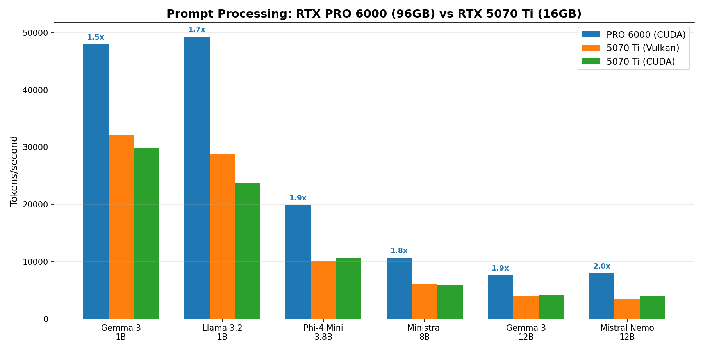
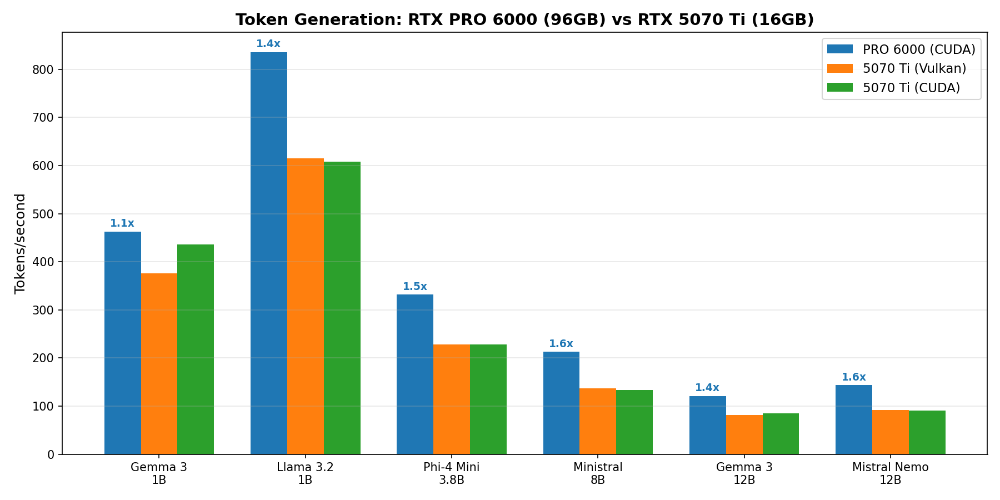
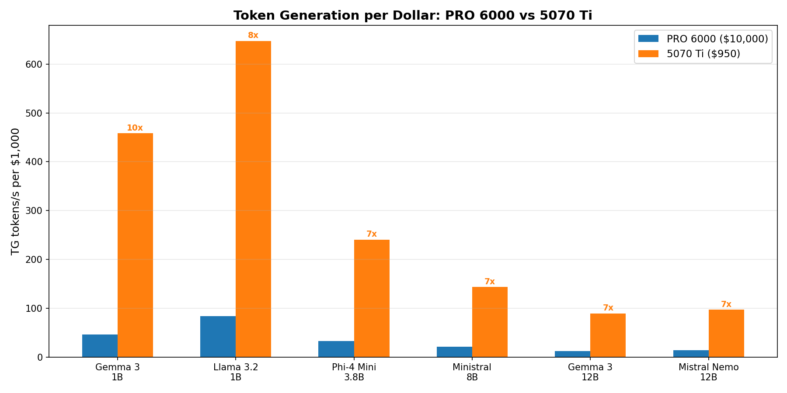
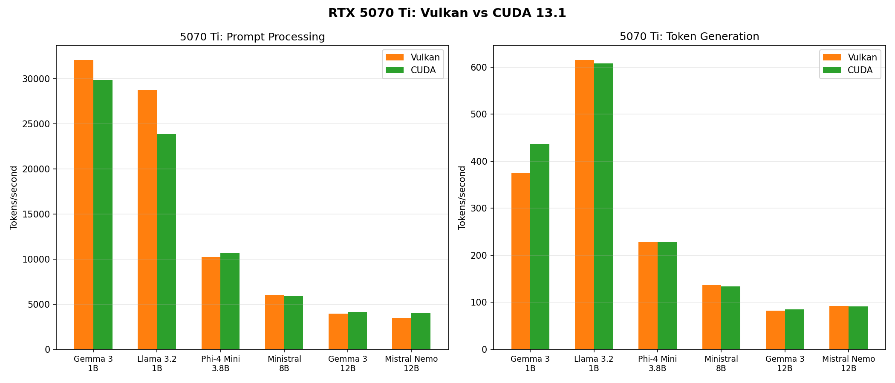

# RTX PRO 6000 vs RTX 5070 Ti : Do You Need 96GB ?

*Tested on AMD Ryzen 7 9800X3D with llama.cpp b7966 via localscore-bench, February 2026*

---

## TL;DR

We benchmarked six LLM models (1B to 12B parameters) on both GPUs with Vulkan and CUDA 13.1. The PRO 6000 is faster, but not by the margin you might expect.

**The headlines :**

- :material-speedometer: **Prompt processing : 1.5 to 2x faster on the PRO 6000.** The gap widens with model size.
- :material-chat-processing: **Token generation : only 1.1 to 1.6x.** The speed you actually feel during a conversation.
- :material-cash-multiple: **Performance per dollar : 5070 Ti wins 4 to 7x.** For models that fit in 16GB, the consumer card crushes on value.
- :material-check-all: **5070 Ti : zero drama.** No crashes, no throttling, no backend anomalies. Pick CUDA or Vulkan, both work.
- :material-memory: **The real question is VRAM, not speed.** The PRO 6000 earns its price by running 32B+ models that cannot fit in 16GB.

<!-- more -->

---

## Why This Comparison Matters

The local LLM community faces a constant tradeoff between VRAM capacity and raw speed. The RTX PRO 6000 Blackwell Server Edition offers 96GB of GDDR7 for massive models. The RTX 5070 Ti packs 16GB at a fraction of the price.

If your model fits in 16GB, how much performance do you actually lose ? We ran the same six models on both cards to find out. Same CPU, same RAM, same llama.cpp build, same quantization.

## Test Setup

| Component | Spec |
|-----------|------|
| CPU | AMD Ryzen 7 9800X3D |
| RAM | 60GB DDR5 |
| GPU 1 | NVIDIA RTX PRO 6000 Blackwell SE (96GB GDDR7, 600W TDP) |
| GPU 2 | NVIDIA GeForce RTX 5070 Ti (16GB GDDR7, 300W TDP) |
| OS | openSUSE Tumbleweed, kernel 6.18.9 |
| Driver | 580.126.09 (PRO 6000), 590.48.01 (5070 Ti) |
| Inference | [llama.cpp :material-open-in-new:](https://github.com/ggml-org/llama.cpp){:target="_blank"} b7966 via [localscore-bench :material-open-in-new:](https://github.com/Mozilla-Ocho/llamafile/tree/main/localscore){:target="_blank"} |
| Vulkan | coopmat2 enabled on both cards |
| CUDA | 13.1 |

Both GPUs share Blackwell architecture and GDDR7 memory. The PRO 6000 is a passive server card with 6x the VRAM and 2x the power budget. All models use Q4_K_M quantization.

**Models tested :** Gemma 3 1B, Llama 3.2 1B, Phi-4 Mini 3.8B, Ministral 8B, Gemma 3 12B, Mistral Nemo 12B.

---

## The Results

### Prompt Processing (Prefill)

*Fig 1 : Prompt processing throughput across six models. The PRO 6000 leads by 1.5x to 2.0x. The gap widens as model size increases.*

| Model | PRO 6000 (CUDA) | 5070 Ti (Vulkan) | 5070 Ti (CUDA) | PRO 6000 lead |
|-------|-----------------|------------------|----------------|---------------|
| Gemma 3 1B | 48,000 t/s | 32,064 t/s | 29,862 t/s | 1.5x |
| Llama 3.2 1B | 49,329 t/s | 28,768 t/s | 23,843 t/s | 1.7x |
| Phi-4 Mini 3.8B | 19,917 t/s | 10,212 t/s | 10,705 t/s | 1.9x |
| Ministral 8B | 10,692 t/s | 6,041 t/s | 5,901 t/s | 1.8x |
| Gemma 3 12B | 7,668 t/s | 3,950 t/s | 4,127 t/s | 1.9x |
| Mistral Nemo 12B | 8,004 t/s | 3,484 t/s | 4,046 t/s | 2.0x |

The PRO 6000's wider memory bus shows up clearly in prefill workloads. At 1B parameters the lead is 1.5x. By 12B it reaches 2x. This matches expectations : prompt processing is memory bandwidth bound, and the PRO 6000 has significantly more of it.

### Token Generation (Interactive Speed)

*Fig 2 : Token generation throughput. The gap narrows to 1.1 to 1.6x. Both cards produce comfortable interactive speeds.*

| Model | PRO 6000 (CUDA) | 5070 Ti (best) | PRO 6000 lead |
|-------|-----------------|----------------|---------------|
| Gemma 3 1B | 463 t/s | 436 t/s | 1.1x |
| Llama 3.2 1B | 836 t/s | 615 t/s | 1.4x |
| Phi-4 Mini 3.8B | 332 t/s | 229 t/s | 1.5x |
| Ministral 8B | 213 t/s | 137 t/s | 1.6x |
| Gemma 3 12B | 121 t/s | 85 t/s | 1.4x |
| Mistral Nemo 12B | 144 t/s | 92 t/s | 1.6x |

Token generation is what you feel during a conversation. The 5070 Ti generates 85 to 615 tokens per second depending on the model. That is faster than human reading speed in every case. The PRO 6000 wins in absolute terms, but the difference is imperceptible during interactive use.

### Performance per Dollar

*Fig 3 : Token generation per $1,000 invested. The 5070 Ti delivers 4 to 6x more tokens per dollar across every model.*

This is where the 5070 Ti dominates. At roughly $950 versus $10,000, the consumer card generates 4 to 7x more tokens per dollar spent. The PRO 6000 justifies its price through VRAM capacity, not throughput on small models. If your workload fits in 16GB, the math is clear.

### 5070 Ti : Vulkan vs CUDA

*Fig 4 : Vulkan and CUDA perform within 5 to 10% on the 5070 Ti. No anomalies, no crashes, no throttling.*

On the PRO 6000, we found significant backend differences. Vulkan won small models, and CUDA suffered a [mysterious 8x regression on Mistral Nemo :material-open-in-new:](./2026-02-12-vulkan-vs-cuda-blackwell.md). The 5070 Ti tells a simpler story : both backends perform nearly identically across the board. Pick whichever you prefer.

---

## Key Findings

### 1. The PRO 6000 is 1.5 to 2x faster, not 6x

You might expect 6x the VRAM and 2x the TDP to produce a proportional speed increase. It does not. The actual advantage is 1.5x on prompt processing and 1.1 to 1.6x on token generation. LLM inference scales with memory bandwidth, not raw VRAM capacity.

### 2. Token generation barely matters at these speeds

Both cards generate tokens faster than humans can read. Mistral Nemo 12B at 92 t/s on the 5070 Ti produces roughly 70 words per second. That is already 3x faster than average reading speed. The delta between the two cards is measurable but not perceptible.

### 3. The 5070 Ti has zero backend drama

Our [PRO 6000 testing :material-open-in-new:](./2026-02-12-vulkan-vs-cuda-blackwell.md) produced six GPU crashes, thermal throttling at 95°C, and an 8x performance anomaly. The 5070 Ti completed all 12 runs without a single issue. It stayed at 33°C idle and its active cooler handled every workload. Consumer cooling works.

### 4. The real question is VRAM, not speed

The PRO 6000 runs Qwen3 32B, Llama 3.3 70B, and other large models that do not fit in 16GB. That is its value proposition. For models under 12B parameters, the 5070 Ti is the better buy by a wide margin.

---

## Who Should Buy What

**Get a 5070 Ti (~$950) if :**

- Your models fit in 16GB (up to ~12B at Q4_K_M)
- You want the best performance per dollar
- You value stability and simple cooling
- You are building a home lab or dev workstation
- Example models : Llama 3.2 1B/3B, Phi-4 Mini 3.8B, Mistral Nemo 12B, Gemma 3 12B, Qwen3 14B

**Get a PRO 6000 (~$10,000) if :**

- You need 32B+ parameter models running locally
- You want 70B+ models without aggressive quantization
- You are running production inference workloads
- VRAM capacity matters more than cost efficiency
- Example models : Qwen3 32B, Llama 3.3 70B (Q4_K_M), Mistral Large 123B (Q2_K), DeepSeek-R1 671B (Q1 with partial offload)

---

## Methodology

PRO 6000 CUDA results use the best of three automated runs from February 11, 2026. The 5070 Ti results are from a single run on February 12, 2026. All models use Q4_K_M quantization. The primary test configuration is pp1024+tg1024 (1,024 token prompt, 1,024 token generation).

PRO 6000 Vulkan results are excluded from this comparison. Our [previous post :material-open-in-new:](./2026-02-12-vulkan-vs-cuda-blackwell.md) documents anomalies in the PRO 6000 Vulkan data from post-crash degraded GPU state. Only validated CUDA runs are used here.

All raw data and scripts are available in the [llm-bench-lab repository :material-open-in-new:](https://github.com/coulof/llm-bench-lab){:target="_blank"}.

---

*This post is part of a series on Blackwell GPU benchmarking. See also : [Vulkan vs CUDA on Blackwell :material-open-in-new:](./2026-02-12-vulkan-vs-cuda-blackwell.md).*
