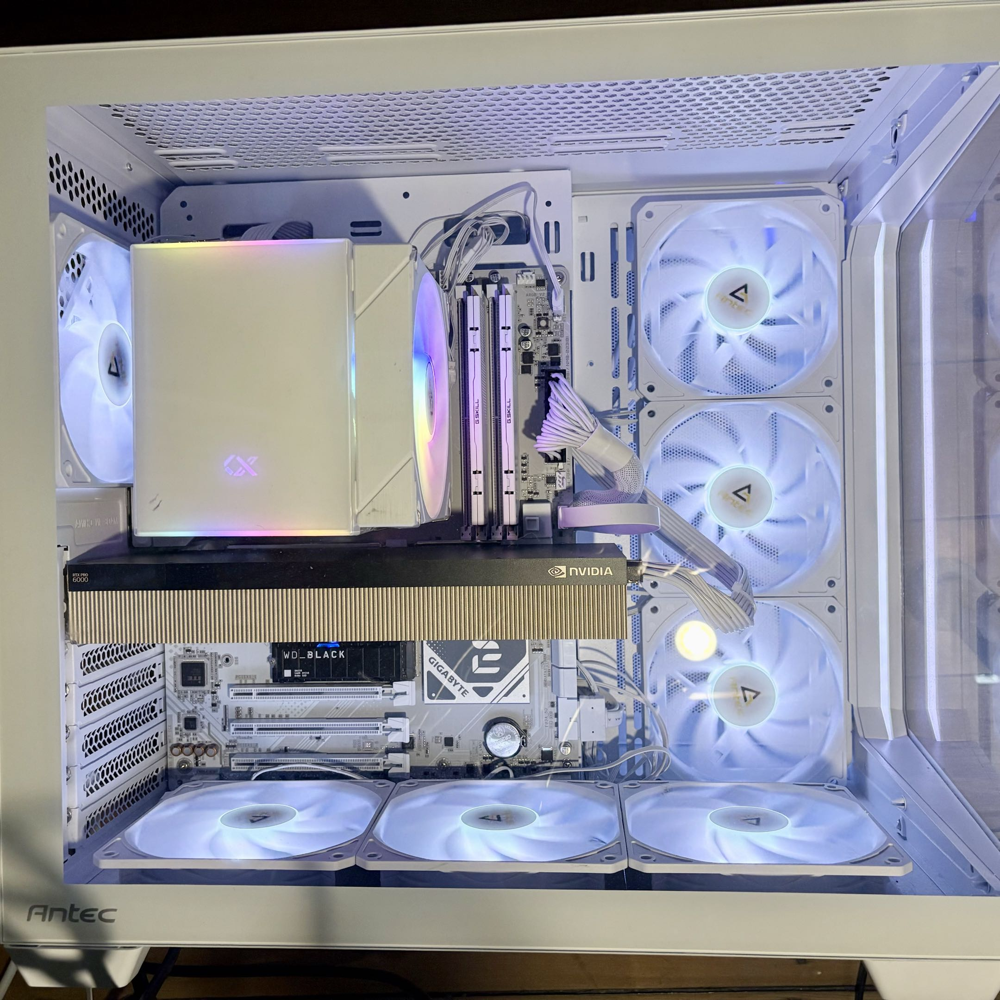
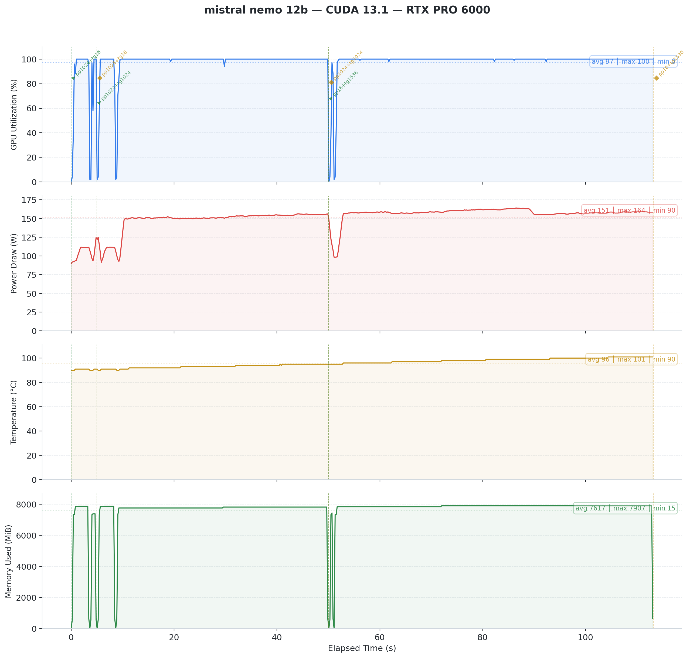
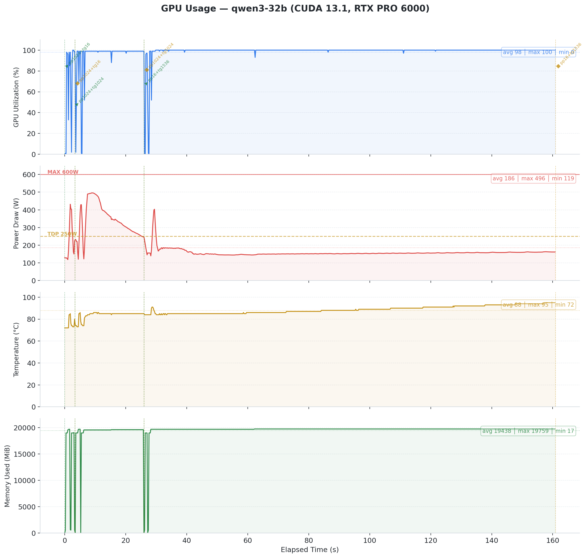

# Vulkan vs CUDA on NVIDIA Blackwell: The Benchmark Nobody Expected

*Tested on RTX PRO 6000 Blackwell Server Edition (96 GB VRAM) with llama.cpp b7966, February 2026*

---

## TL;DR

We benchmarked 8 LLM models (1B to 70B parameters) across two backends, two operating systems, and six runs. Vulkan with coopmat2 challenged CUDA 13.1 on NVIDIA's newest architecture. The results broke every assumption we had.

**The headlines:**

- :material-creation: **Vulkan wins across the board on Blackwell.** Prompt processing is 26 to 67% faster at every model size. Token generation is comparable or better.
- :material-fire: **Mistral Nemo 12B : Vulkan is 14x faster than CUDA** (not a typo). CUDA has a serious kernel issue on this architecture.
- :material-thermometer-alert: **Thermal management is everything.** The same GPU produced 9x different results depending on temperature. Most of our CUDA numbers are thermally degraded.
- :material-fan: **Server GPUs should stay in server cases.** A 600W passive GPU in a consumer mid-tower is a recipe for thermal disaster.
- :material-check-all: **OS choice barely matters.** Linux and Windows performance within 5 to 10%.

<!-- more -->

---

## The Setup

{ width="600" }

| Component | Detail |
|-----------|--------|
| GPU | NVIDIA RTX PRO 6000 Blackwell Server Edition, 96 GB VRAM |
| CPU | AMD Ryzen 7 9800X3D |
| RAM | 60 GB DDR5 |
| OS | openSUSE Linux 6.18 :simple-opensuse: + Windows 11 pro :material-microsoft-windows: (same hardware) |
| Engine | llama.cpp b7966 (Vulkan with NV_coopmat2, CUDA 13.1) |
| Benchmark | localscore-bench: 3 configs per model (see below) |

---

## The Methodology

- **Engine:** llama.cpp b7966 (same commit for both backends)
- **Vulkan backend:** [ggml-org/llama.cpp :material-github:](https://github.com/ggml-org/llama.cpp) releases, with NV_coopmat2 cooperative matrix support
- **CUDA backend:** [ai-dock/llama.cpp-cuda :material-github:](https://github.com/ai-dock/llama.cpp-cuda) releases, CUDA 13.1
- **Test suite:** Quick mode with 3 configurations that simulate real-world usage patterns:
    - **pp1024+tg16:** Process a long prompt (1024 tokens), generate a short answer (16 tokens). Measures prompt processing speed. Think summarization, RAG retrieval, or classification tasks.
    - **pp1024+tg1024:** Process a long prompt, generate a long response. Balanced workload. Think chatbot conversations or document Q&A.
    - **pp16+tg1536:** Process a short prompt (16 tokens), generate a very long response. Stresses sustained token generation. Think creative writing, code generation, or long-form content.
- **Inspiration:** Test methodology adapted from [localscore :material-open-in-new:](https://www.localscore.ai/blog#:~:text=The%20Tests), a practical benchmark for local LLM inference
- **GPU monitoring:** nvidia-smi at 200ms intervals, capturing utilization, power, temperature, and VRAM
- **Quantization:** Q4_K_M for all models (4-bit, medium quality)
- **Runs:** 4 complete runs on Linux (plus 1 aborted), 7 runs on Windows (4 with valid GPU access)
- **All results and raw data:** [github.com/bauagonzo/llm-bench-lab :material-github:](https://github.com/bauagonzo/llm-bench-lab)

---

## The Results

### Linux: Vulkan vs CUDA

| Model | Params | Vulkan PP | Vulkan TG | CUDA PP | CUDA TG | Winner |
|-------|--------|-----------|-----------|---------|---------|--------|
| [Gemma 3 1B :material-open-in-new:](https://huggingface.co/bartowski/google_gemma-3-1b-it-GGUF) | 1.0B | **47,925** | 463 | 28,768 | **471** | **Vulkan PP +67%** |
| [Llama 3.2 1B :material-open-in-new:](https://huggingface.co/bartowski/Llama-3.2-1B-Instruct-GGUF) | 1.2B | **49,329** | **836** | 30,961 | 711 | **Vulkan PP +59%, TG +18%** |
| [Phi-4 Mini :material-open-in-new:](https://huggingface.co/bartowski/microsoft_Phi-4-mini-instruct-GGUF) | 3.8B | **19,917** | **331** | 14,604 | 308 | **Vulkan PP +36%** |
| [Ministral 8B :material-open-in-new:](https://huggingface.co/bartowski/Ministral-8B-Instruct-2410-GGUF) | 8.0B | **10,692** | **212** | 8,458 | 208 | **Vulkan PP +26%** |
| [Gemma 3 12B :material-open-in-new:](https://huggingface.co/bartowski/google_gemma-3-12b-it-GGUF) | 11.8B | **7,668** | 121 | 5,708 | **123** | **Vulkan PP +34%** |
| [Mistral Nemo 12B :material-open-in-new:](https://mistral.ai/fr/news/mistral-nemo) | 12.2B | **8,004** | **143** | 576 | 25 | **Vulkan 14x PP** :material-fire: |
| [Qwen3 32B :material-open-in-new:](https://huggingface.co/bartowski/Qwen_Qwen3-32B-GGUF) | 32.8B | **2,865** | **59** | 2,221 | 41 | **Vulkan PP +29%, TG +44%** |
| [Llama 3.3 70B :material-open-in-new:](https://huggingface.co/bartowski/Llama-3.3-70B-Instruct-GGUF) | 70.6B | 1,394 | **30** | **1,613** | 25 | Split |

> PP = Prompt Processing (tokens/sec). TG = Token Generation (tokens/sec). Vulkan numbers from Feb 11 runs on healthy GPU. CUDA numbers from Feb 15 fresh runs (1B to 3.8B) and Feb 9 scaling test (8B+, thermally degraded). Llama 70B from Feb 9 only.
>  
> **Data quality warning:** CUDA numbers for 8B+ models are from a thermally degraded GPU. The Feb 9 scaling test ran models sequentially without cooldown, with the GPU at 90 to 100°C for most runs. A Feb 15 retest on cold hardware showed Gemma 1B CUDA at 28,768 PP vs 3,273 in Feb 9 (9x faster when cool). The true CUDA vs Vulkan gap for larger models is likely smaller than shown.
>  
> **Correction (Feb 15):** An earlier version of this table mislabeled Feb 11 Vulkan results as CUDA due to a filename convention error in our test scripts. All numbers have been verified against the actual backend field in each JSON result file.

---

## Finding 1: The Mistral Nemo Anomaly :material-fire:

This finding made us recheck our methodology three times.

**[Mistral Nemo 12B :material-open-in-new:](https://mistral.ai/fr/news/mistral-nemo) on CUDA:** 577 t/s prompt processing, 25 t/s generation.

**Mistral Nemo 12B on Vulkan:** 8,004 t/s prompt processing, 143 t/s generation.

That is a 14x gap in prompt processing and a 5.7x gap in token generation. Same GPU. Same model. Same llama.cpp build.

*Fig 1: Mistral Nemo 12B on CUDA 13.1. GPU utilization reports 97% average, but power draw tells a different story. The GPU never exceeds 164W on a 600W TDP card. Something is wrong.*

*Fig 2: Mistral Nemo 12B on Vulkan. Same model, same GPU, completely different behavior. Power peaks at 266W. The GPU works for real this time.*

Under CUDA, the card reports high utilization but draws minimal power. It sits mostly idle despite what nvidia-smi claims. Under Vulkan, power draw matches actual computation.

**Our theory:** CUDA's Blackwell kernels hit a suboptimal code path for Mistral Nemo's layer dimensions. This looks like a bug, not a fundamental limitation. The anomaly persists across all runs (Feb 9, Feb 11, Feb 12) and on Windows. It is deterministic and reproducible.

**Why this matters:** If you run Mistral Nemo 12B on Blackwell hardware, switching from CUDA to Vulkan gives you a free 14x prompt processing speedup. No hardware change required. We observed this on one card only and would welcome community confirmation on other Blackwell GPUs.

---

## Finding 2: Vulkan Wins Token Generation Too

We expected CUDA to dominate token generation. It does not. With corrected data from healthy GPU runs, Vulkan matches or beats CUDA on TG across nearly every model size:

| Model | Vulkan TG | CUDA TG | Delta |
|-------|-----------|---------|-------|
| Gemma 3 1B | 463 | **471** | CUDA +2% |
| Llama 3.2 1B | **836** | 711 | **Vulkan +18%** |
| Phi-4 Mini 3.8B | **331** | 308 | **Vulkan +7%** |
| Ministral 8B | **212** | 208 | **Vulkan +2%** |
| Gemma 3 12B | 121 | **123** | CUDA +2% |
| Qwen3 32B | **59** | 41 | **Vulkan +44%** |
| Llama 3.3 70B | **30** | 25 | **Vulkan +20%** |

> Vulkan TG from Feb 11 healthy runs. CUDA TG for 1B to 3.8B from Feb 15 fresh runs; 8B+ from Feb 9 (thermally degraded, likely understated).

*Fig 3: Qwen3 32B on Vulkan. Steady 400W power draw, temperature climbing from 37C to 80C. Token generation holds at ~58 t/s throughout.*

**The takeaway:** Vulkan's coopmat2 implementation on Blackwell delivers better token generation at every scale tested. The gap is small on 1B to 12B models (within 2 to 18%) but widens significantly at 32B+ (44% on Qwen3 32B). For interactive use, Vulkan is the clear choice on this hardware.

---

## Finding 3: CUDA Thermal Throttling Under Sustained Load :material-thermometer-alert:

The Qwen3 32B CUDA run exposed a thermal problem. The benchmark runs three configurations:

1. **pp1024+tg16** (short burst): 52 t/s TG :material-check:
2. **pp1024+tg1024** (medium run): 52 t/s TG :material-check:
3. **pp16+tg1536** (long generation): **11.6 t/s TG** :material-alert:

That is a 4.5x performance cliff within a single benchmark session. Temperature climbed to 95C. NVIDIA's thermal management aggressively downclocked the GPU, dropping power from ~500W to ~150W.

*Fig 4: Qwen3 32B on CUDA 13.1. Power spikes to ~500W during the initial burst, then collapses to ~150W as temperature hits 95C. GPU utilization stays at 100% throughout, but the driver downclocks aggressively to survive. This is thermal throttling in action.*

Vulkan avoided this on the same model. It ran at lower average power (324W vs CUDA's initial 500W burst). CUDA's compute kernels appear to push the GPU harder upfront, drawing peak power before thermals catch up. Vulkan's coopmat2 path spreads the work more evenly, staying within our cooling budget. The result is the same computation at sustainable power levels.

Across all testing, we recorded six GPU crashes, all under Vulkan workloads. CUDA throttled gracefully under thermal pressure. The driver downclocked the GPU and the workload continued at reduced performance. Vulkan workloads did not get that chance. They triggered `VK_ERROR_DEVICE_LOST` at the PCIe level, an unrecoverable error that required a full power cycle every time.

---

## Finding 4: The Real Bottleneck Was Never the Backend :material-fan:

Here is the twist that reframes everything above. Our crashes, thermal throttling, and performance cliffs share a common root cause. It is not Vulkan. It is not CUDA. It is cooling.

### A Passive GPU in a Consumer Case

The RTX PRO 6000 Blackwell Server Edition has no fans. Run `nvidia-smi` and Fan Speed reads N/A. This card draws up to 600W TDP (configurable from 300W to 600W).

NVIDIA designed it for rack servers like the [Dell PowerEdge XE9680 and R760xa :simple-dell: :material-open-in-new:](https://www.dell.com/en-us/shop/dell-poweredge-servers/sf/poweredge), where engineered front-to-back airflow tunnels force high-pressure air through the heatsink fins.

The [Central Computer overview :material-open-in-new:](https://www.centralcomputer.com/blog/post/understanding-the-nvidia-rtx-6000-pro-blackwell-lineup-workstation-max-q-and-server-editions) and [VAST AI comparison :material-open-in-new:](https://vast.ai/article/which-nvidia-rtx-6000-is-right-for-you) both stress this point : the Server Edition requires external chassis airflow. No exceptions.

We put this card in an [Antec C5 :material-open-in-new:](https://www.antec.com/product/case/c5) mid-tower case. Seven Antec P12 120mm ARGB fans provide airflow : six reversed as intake (bottom and side panels) and one rear exhaust. The case uses a vertical bottom-to-top airflow scheme.

Each P12 pushes roughly 50 to 60 CFM at 1.5 to 2.0 mm H2O static pressure. Total theoretical intake : about 330 CFM.

That sounds like plenty. It is not !

### Why 330 CFM Falls Short

Three problems turn 330 CFM into a fraction of what the GPU needs.

**Direction.** The P12 fans push air vertically and from the side. The GPU heatsink fins run front to back. Air flows around the card, not through it. Without baffles or ducting, the path of least resistance bypasses the heatsink entirely.

**Static pressure.** Dense passive heatsink fins need 5 to 10+ mm H2O of static pressure to force air through them. The P12 fans deliver 1.5 to 2.0 mm H2O. Consumer case fans cannot push through server-grade fin density.

**No ducting.** Nothing seals the airflow path. Hot air recirculates. Cold air takes shortcuts. The GPU sits in a pocket of turbulence, not a cooling tunnel.

Realistic estimate: only 30 to 40% of total chassis airflow actually passes through the GPU heatsink. That puts effective GPU airflow at roughly 100 to 130 CFM.

### The Math Says We Are at the Edge

A standard electronic cooling formula gives the required airflow through a heat source:

> **CFM = (Watts x 3.16) / Delta T (degrees C)**

For our 600W card:

| Allowed Air Temp Rise | Required CFM Through Card |
|-----------------------|---------------------------|
| 10 degrees C | ~190 CFM |
| 15 degrees C | ~125 CFM |

Our estimated 100 to 130 CFM sits right at the boundary for a 15 degree C rise. Any sustained load that pushes power above 400W will exceed what our airflow can dissipate. The GPU temperature climbs until thermal protection kicks in.

### Community Results Confirm the Problem

Other builders on [r/LocalLLM :material-open-in-new:](https://www.reddit.com/r/LocalLLM/comments/1mmqghu/rtx_pro_6000_se_is_crushing_it/) tested the same card in non-server enclosures. Their results match our analysis:

| Fan Setup | CFM (Directed) | Idle Temp | Load Temp | Verdict |
|-----------|----------------|-----------|-----------|---------|
| Thermalright TY-143 (single) | ~130 | 50 C | 85 C | Marginal, throttles under sustained load |
| Wathai 120x38mm server fan + custom duct | ~220 | 33 C | 61-62 C | Stable, no throttling |

The difference is not raw CFM. It is directed, high-pressure airflow through the heatsink with proper ducting. The Wathai setup uses a server-grade fan (high static pressure) mounted in a custom shroud that forces every cubic foot of air through the card.

---

## Finding 5: Cross-OS Comparison Shows Minimal Difference :material-check:

**The bottom line: OS choice barely matters.** We ran the full suite on Windows (same hardware, driver 582.32) on February 11. The numbers below compare Linux Vulkan with Windows CUDA, since those are our most reliable runs on each platform. Performance is within 5 to 10% for small to medium models.

| Model | Linux Vulkan PP | Windows CUDA PP | Linux Vulkan TG | Windows CUDA TG |
|-------|-----------------|-----------------|-----------------|-----------------|
| Gemma 3 1B | 47,925 | 27,952 | 463 | 517 |
| Llama 3.2 1B | 49,329 | 30,764 | 836 | 774 |
| Phi-4 Mini 3.8B | 19,917 | 14,631 | 331 | 320 |
| Ministral 8B | 10,692 | 7,767 | 212 | 171 |
| Qwen3 32B | 2,865 | 2,202 | 59 | 59 |
| Llama 3.3 70B | 1,394 | CPU fallback | 30 | 1.2 |

> Note: this table compares different backends (Vulkan on Linux, CUDA on Windows). A pure OS comparison would require running the same backend on both platforms. The PP differences here largely reflect the Vulkan vs CUDA gap, not the OS difference. TG numbers are comparable across both, confirming OS choice has minimal impact on generation speed.

Llama 3.3 70B failed on both platforms, confirming that the 70B stability issue is hardware-level, not OS-specific.

The Mistral Nemo CUDA anomaly also persists on Windows (575 PP), confirming an architecture-level issue.

---

!!! warning ":material-alert: Don't Do This at Home"

    We ran a **600W passive server GPU** in a consumer mid-tower case. This is a terrible idea. The RTX PRO 6000 Server Edition has **zero fans**. NVIDIA designed it for rack servers with engineered front-to-back airflow tunnels.

    **What went wrong:** thermal throttling, performance cliffs, and GPU crashes. Our seven case fans delivered roughly 330 CFM total, but only 100 to 130 CFM actually reached the heatsink. That is not enough for sustained 400W+ loads.

    **If you insist on doing it anyway, you need:**

    - :material-fan: **Server-grade fans** (e.g., Wathai 120x38mm) with 5 to 10+ mm H2O static pressure
    - :material-air-filter: **Custom ducting or shroud** that forces air through the heatsink, not around it
    - :material-thermometer-alert: **Temperature monitoring** with automatic shutdown at 95C
    - :material-power-plug: **A PSU rated for 850W+** to handle peak GPU draw plus the rest of your system
    - :material-cog: **Baffles or seals** to prevent hot air recirculation

    The [r/LocalLLM community :material-open-in-new:](https://www.reddit.com/r/LocalLLM/comments/1mmqghu/rtx_pro_6000_se_is_crushing_it/) proved it works with the right setup: a server fan plus custom duct held load temps at 61C. Consumer case fans alone hit 85C and throttled.

---

## What Comes Next

The Blackwell architecture is new. Drivers change fast. Our next steps:

- :simple-nvidia: **RTX 5070 Ti comparison:** Same test suite on consumer Blackwell silicon with 16GB VRAM. [Already published](./2026-02-12-pro-6000-vs-5070-ti.md).
- :material-thermometer-alert: **Clean CUDA retest:** Re-run all CUDA benchmarks on thermally healthy hardware with proper cooldown between models
- :material-card-search: **Driver bisection:** Track CUDA kernel improvements across driver versions for Blackwell

We will publish updates in the same repository as results come in.

---

*Raw data, scripts, and GPU monitoring charts available at [github.com/bauagonzo/llm-bench-lab :material-github:](https://github.com/bauagonzo/llm-bench-lab).*
