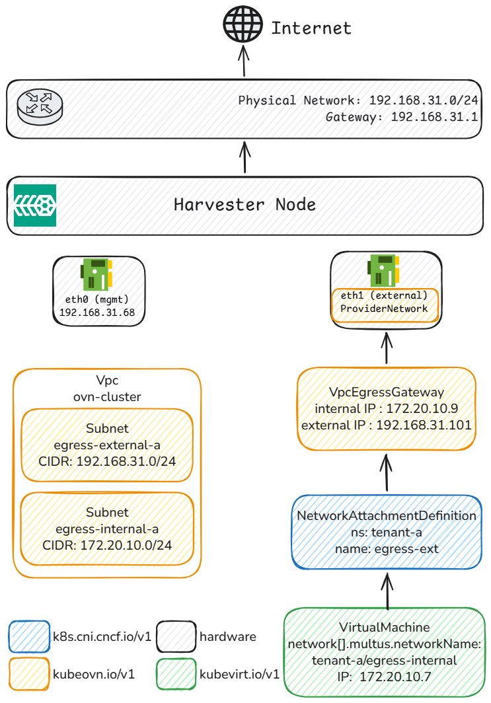
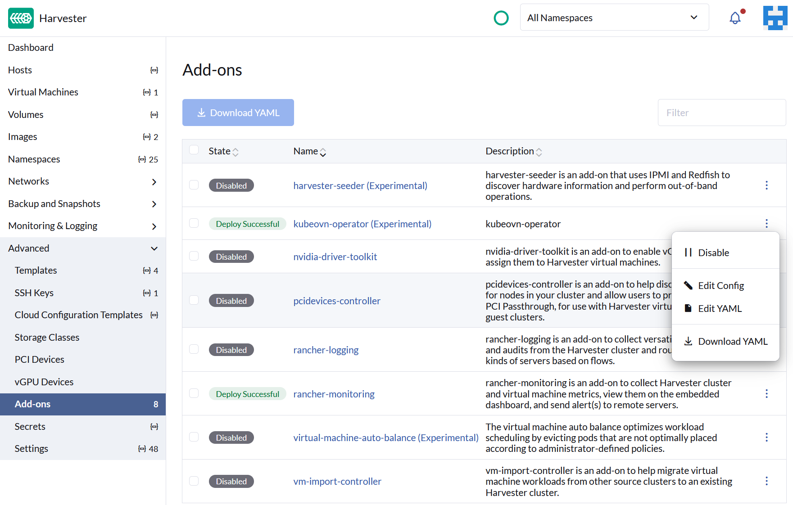
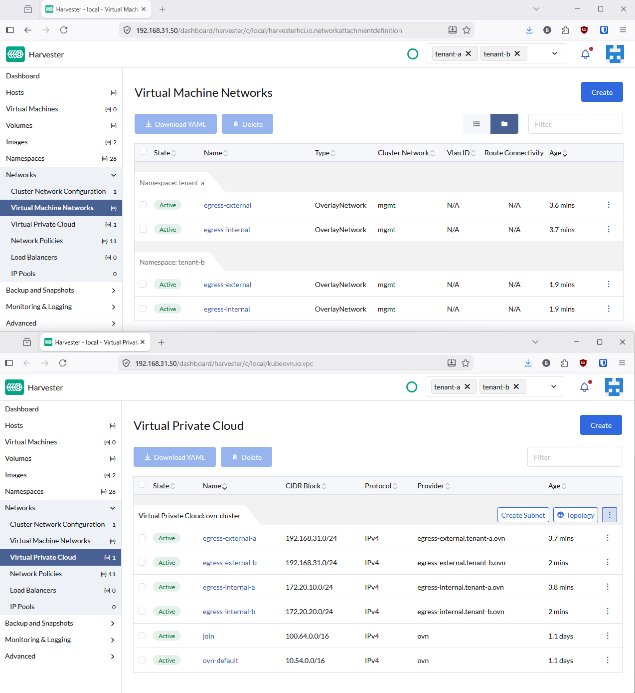
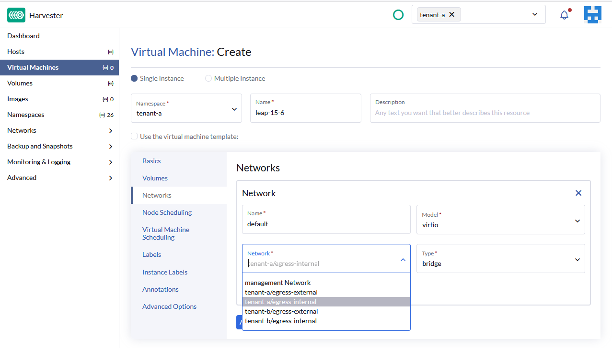
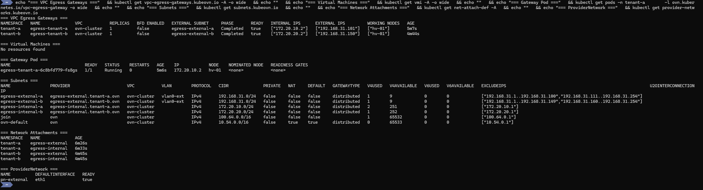
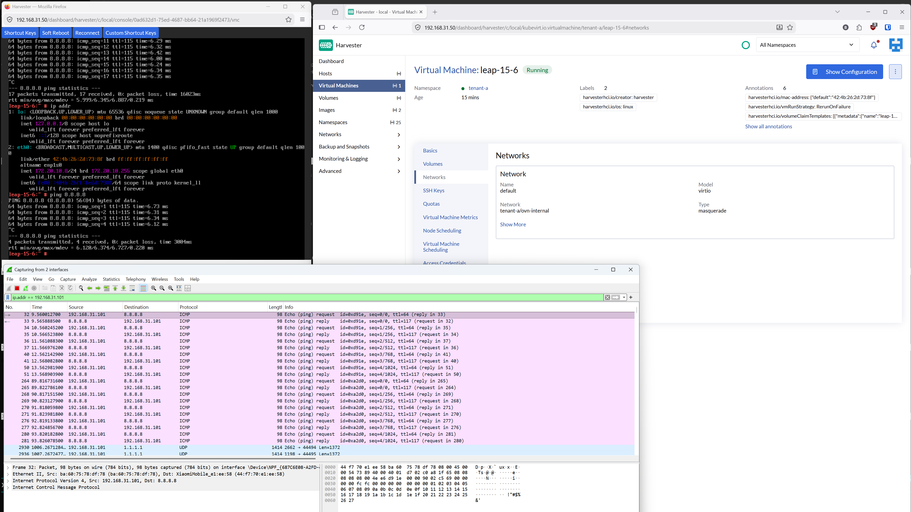

# Per-Namespace Egress IPs on Harvester with Kube-OVN `VpcEgressGateway`

This article is the result of one of my very first deep-dives into Harvester :simple-suse: (aka [SUSE Virtualization](https://www.suse.com/products/rancher/virtualization/)) not related to storage. It describes how to configure dedicated egress IPs per tenant (aka `Namespace`) on Harvester using Kube-OVN's `VpcEgressGateway` and we will go in unexplored territory here with release-candidates, experimental features & hot fixes on top of bugs that are yet to be reported.



<!-- more -->

## The problem

In multi-tenant environments, each tenant's traffic often needs to exit through a known, stable IP address.
Firewalls, compliance audits, and partner integrations all rely on predictable source IPs rather than node IPs that change with pod scheduling.

## The solution

Kube-OVN's [`VpcEgressGateway`](https://kube-ovn.readthedocs.io/zh-cn/latest/en/vpc/vpc-egress-gateway/){target="_blank"} CRD provides exactly this: a per-namespace egress gateway that applies [SNAT](https://en.wikipedia.org/wiki/Network_address_translation#SNAT){target="_blank"} :material-wikipedia: to overlay traffic through a dedicated external IP.
It supports [ECMP](https://en.wikipedia.org/wiki/Equal-cost_multi-path_routing){target="_blank"} :material-wikipedia: load balancing and [BFD](https://en.wikipedia.org/wiki/Bidirectional_Forwarding_Detection){target="_blank"} :material-wikipedia: for fast failover.

On Harvester v1.8.0-rc2, the [kubeovn-operator addon](https://docs.harvesterhci.io/v1.8/advanced/addons/kubeovn-operator){target="_blank"} ships Kube-OVN v1.15.4 with `--non-primary-cni-mode=true` enabled by default.
This makes `VpcEgressGateway` available alongside Harvester's primary Canal CNI.

!!! info "Harvester UI naming"
    The Harvester UI renames certain Kubernetes resource kinds. This blog uses the original API names, but here is the mapping:

    | Kubernetes Resource              | Harvester UI Name         |
    |----------------------------------|---------------------------|
    | `NetworkAttachmentDefinition`    | Virtual Machine Networks  |
    | `Subnet`                         | Virtual Private Cloud     |

## Architecture

Each tenant gets its own overlay subnet, egress gateway, and dedicated external IP.
The OVN logical router uses policy-based routing to redirect tenant traffic through the corresponding gateway, which applies SNAT before forwarding to the physical network.
All VMs within a tenant namespace share the same egress IP, regardless of which node they run on.

## Prerequisites

- Harvester v1.8.0-rc2 with the kubeovn-operator addon enabled :simple-kubernetes:
- A dedicated NIC (`eth1`) on the same L2 segment as the management network :material-network-outline:
- MAC address spoofing enabled on the dedicated NIC (Hyper-V: VM Settings > Network Adapter > Advanced Features). Without it, OVS sends packets with pod MACs that Hyper-V silently drops. :material-microsoft-windows:



## Setup

### Step 1: Create the infrastructure

Create a Kube-OVN `ProviderNetwork` on the dedicated NIC.
This creates an [OVS](https://www.openvswitch.org/){target="_blank"} bridge that connects OVN to the physical network.

```yaml
# manifests/infra/00-provider-network.yaml
apiVersion: kubeovn.io/v1
kind: ProviderNetwork
metadata:
  name: pn-external
spec:
  defaultInterface: eth1
```

```yaml
# manifests/infra/01-vlan.yaml
apiVersion: kubeovn.io/v1
kind: Vlan
metadata:
  name: vlan0-ext
spec:
  id: 0
  provider: pn-external
```

```bash
kubectl apply -f manifests/infra/
# Wait for ProviderNetwork to be READY
kubectl get provider-networks.kubeovn.io pn-external
```

### Step 2: Configure tenant networking

Each tenant needs four resources: an internal OVN overlay for VM traffic and an external underlay for the gateway's physical connectivity.
Both use `kube-ovn` type [`NetworkAttachmentDefinitions`](https://www.cni.dev/docs/spec/){target="_blank"} (NADs), which is what Harvester's network webhook accepts.

**Internal overlay** (where VMs live):

```yaml
# NAD
apiVersion: k8s.cni.cncf.io/v1
kind: NetworkAttachmentDefinition
metadata:
  name: ovn-internal
  namespace: tenant-a
spec:
  config: >-
    {
      "cniVersion": "0.3.1",
      "type": "kube-ovn",
      "server_socket": "/run/openvswitch/kube-ovn-daemon.sock",
      "provider": "ovn-internal.tenant-a.ovn"
    }
---
# Subnet
apiVersion: kubeovn.io/v1
kind: Subnet
metadata:
  name: egress-internal-a
spec:
  cidrBlock: 172.20.10.0/24
  gateway: 172.20.10.1
  provider: ovn-internal.tenant-a.ovn
  vpc: ovn-cluster
  enableDHCP: true
```

**External underlay** (connects the gateway to the physical network):

```yaml
# NAD
apiVersion: k8s.cni.cncf.io/v1
kind: NetworkAttachmentDefinition
metadata:
  name: egress-ext
  namespace: tenant-a
spec:
  config: >-
    {
      "cniVersion": "0.3.1",
      "type": "kube-ovn",
      "server_socket": "/run/openvswitch/kube-ovn-daemon.sock",
      "provider": "egress-ext.tenant-a.ovn"
    }
---
# Subnet
apiVersion: kubeovn.io/v1
kind: Subnet
metadata:
  name: egress-external-a
spec:
  cidrBlock: 192.168.31.0/24
  gateway: 192.168.31.1
  provider: egress-ext.tenant-a.ovn
  vlan: vlan0-ext
  vpc: ovn-cluster
  excludeIps:
    - 192.168.31.1..192.168.31.100
    - 192.168.31.111..192.168.31.254
```



### Step 3: Deploy the egress gateway

Create the `VpcEgressGateway` CRD.
The `policies.subnets` field must reference the **internal** subnet so that OVN's lr-policy knows which traffic to redirect.

```yaml
apiVersion: kubeovn.io/v1
kind: VpcEgressGateway
metadata:
  name: egress-tenant-a
  namespace: tenant-a
spec:
  vpc: ovn-cluster
  replicas: 1
  internalSubnet: egress-internal-a
  externalSubnet: egress-external-a
  externalIPs:
    - 192.168.31.101
  policies:
    - snat: true
      subnets:
        - egress-internal-a
```

### Step 4: Apply the workaround 🔥

The `VpcEgressGateway` controller has a known issue in `--non-primary-cni-mode`: it does not attach the internal OVN `Subnet` as a Multus network interface.

This is caused by a missing annotation.

A simple patch fixes this by setting the internal NAD as the pod's default network:

```bash
./manifests/patch-deployment.sh tenant-a egress-tenant-a
```

The [`patch-deployment.sh`](https://github.com/coulof/egress-ip-poc/blob/main/manifests/patch-deployment.sh){target="_blank"} script adds `v1.multus-cni.io/default-network: tenant-a/ovn-internal` to the gateway Deployment's pod template.
This makes the gateway pod's `eth0` the OVN overlay interface, matching the expected behavior from the [`VpcEgressGateway` documentation](https://kube-ovn.readthedocs.io/zh-cn/latest/en/vpc/vpc-egress-gateway/){target="_blank"}.

!!! note
    This workaround is needed because the equivalent fix ([PR #6212](https://github.com/kubeovn/kube-ovn/pull/6212){target="_blank"}) was only applied to `VpcNatGateway`, not `VpcEgressGateway`.

### Step 5: Deploy VMs

Create VMs attached to the tenant's internal OVN overlay.
With DHCP enabled on the `Subnet`, VMs automatically receive an IP and default route via the OVN gateway.

```bash
kubectl apply -f manifests/tenant-a/06-vm-test-1.yaml
```



## Verification

### Resource overview

Run the following command to check all resources at once:

??? example "Full verification command"

    ```bash
    echo "=== VPC Egress Gateways ===" \
      && kubectl get vpc-egress-gateways.kubeovn.io -A -o wide \
      && echo "" \
      && echo "=== Virtual Machines ===" \
      && kubectl get vmi -A -o wide \
      && echo "" \
      && echo "=== Gateway Pod ===" \
      && kubectl get pods -n tenant-a \
           -l ovn.kubernetes.io/vpc-egress-gateway -o wide \
      && echo "" \
      && echo "=== Subnets ===" \
      && kubectl get subnets.kubeovn.io \
      && echo "" \
      && echo "=== Network Attachments ===" \
      && kubectl get net-attach-def -A \
      && echo "" \
      && echo "=== ProviderNetwork ===" \
      && kubectl get provider-networks.kubeovn.io
    ```



When everything is healthy, you should see:

- Egress Gateway: READY, egress IP `192.168.31.101`
- VM: running on `172.20.10.8`
- Gateway pod: running on `172.20.10.9`
- `Subnets`: internal overlay + external underlay
- `NetworkAttachmentDefinitions`: both in `tenant-a`
- `ProviderNetwork`: `eth1` READY

### Connectivity and egress proof :material-magnify:

From the VM console, ping any external host:

```
ping 8.8.8.8
```

Then capture traffic on the dedicated NIC (eth1) with filter `host 192.168.31.101`.
Traffic from the VM appears with source IP `192.168.31.101`, the tenant's egress IP, not the node IP.



## Adding more tenants

You can repeat steps 2 through 5 with a different namespace, internal subnet CIDR, and external IP.

For example, the repo gives configuration for:

| Tenant   | Internal Subnet  | Egress IP       |
|----------|------------------|-----------------|
| tenant-a | 172.20.10.0/24   | 192.168.31.101  |
| tenant-b | 172.20.20.0/24   | 192.168.31.150  |

That way all VMs in a given tenant exit with the same source IP, and each tenant's traffic is fully isolated.

## Key design decisions

**Why a dedicated NIC?**
Harvester's management bridge (`mgmt-br`) is a Linux bridge with VLAN filtering on top of a bond.
Using it as a Kube-OVN `ProviderNetwork` causes ARP resolution failures.
A dedicated NIC avoids this entirely.

**Why kube-ovn type NADs?**
Harvester's network webhook only accepts `bridge` and `kube-ovn` type `NetworkAttachmentDefinitions`.
The stock `VpcEgressGateway` docs use macvlan, which Harvester rejects.
Using `kube-ovn` type `NetworkAttachmentDefinitions` with a `ProviderNetwork` achieves the same result while passing webhook validation.

**Why does `policies.subnets` reference the internal subnet?**
The `VpcEgressGateway` creates OVN lr-policy rules that match source IPs.
VMs are on the internal overlay subnet, so the policy must reference that subnet for the reroute to trigger.

## Repository

All manifests are available at [github.com/coulof/egress-ip-poc](https://github.com/coulof/egress-ip-poc){target="_blank"} :simple-github:.

```bash
kubectl apply -f manifests/infra/
kubectl apply -f manifests/tenant-a/
./manifests/patch-deployment.sh tenant-a egress-tenant-a
```

## Conclusion

With Kube-OVN's `VpcEgressGateway` and a dedicated NIC, you can assign stable, per-tenant egress IPs on Harvester.
Each namespace gets its own SNAT gateway, making firewall rules and compliance audits straightforward.
The setup requires a workaround for `--non-primary-cni-mode`, but the result is a clean, repeatable pattern that scales to as many tenants as you need.

## Further reading

- [Kube-OVN VpcEgressGateway documentation](https://kube-ovn.readthedocs.io/zh-cn/latest/en/vpc/vpc-egress-gateway/){target="_blank"} :material-network-outline:
- [Harvester kubeovn-operator addon](https://docs.harvesterhci.io/v1.8/advanced/addons/kubeovn-operator){target="_blank"} :simple-suse:
- [Harvester networking deep-dive](https://docs.harvesterhci.io/v1.8/networking/deep-dive){target="_blank"} :simple-suse:
- [Kube-OVN architecture overview](https://kube-ovn.readthedocs.io/zh-cn/latest/en/start/architecture/){target="_blank"} :material-network-outline:
