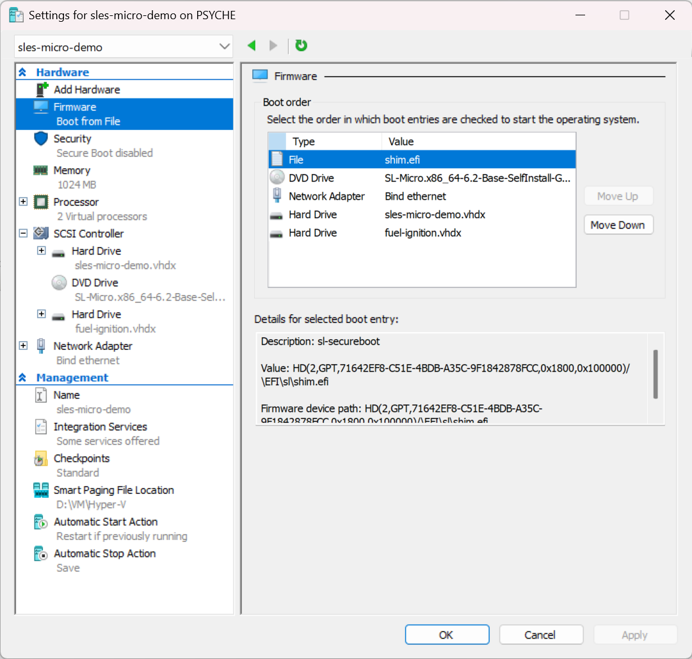

# Installing SUSE Linux Micro on Hyper-V

SUSE Linux Micro doesn't install like regular desktop or server OS ; farewell the YaST wizard.

The selfinstall ISO just copies a pre-built image to disk, then runs a first-boot configuration from a **labeled block device** you provide.

The [official documentation](https://documentation.suse.com/sle-micro/6.1/html/Micro-deployment-selfinstall-images/index.html){target="_blank"} :simple-suse: was both too long for my usage and too shallow with regards to Hyper-V.

Here's the shortest path from zero to a running SLE Micro on Hyper-V.

:simple-youtube: Video walkthrough :
<div style="position: relative; padding-bottom: 56.25%; height: 0; overflow: hidden;">
  <iframe style="position: absolute; top: 0; left: 0; width: 100%; height: 100%;" src="https://www.youtube.com/embed/_re1VPAT7d8?si=6AgcsjkPzcBaRn_e" title="YouTube video player" frameborder="0" allow="accelerometer; autoplay; clipboard-write; encrypted-media; gyroscope; picture-in-picture; web-share" referrerpolicy="strict-origin-when-cross-origin" allowfullscreen></iframe>
</div>

<!-- more -->

## 1. Download the base image

Grab the **selfinstall ISO** from the [SUSE Customer Center](https://scc.suse.com/admin/products){target="_blank"} :simple-suse: for the supported flavor or [openSUSE MicroOS](https://microos.opensuse.org/){target="_blank"} :simple-opensuse: downloads page. This is the installer that copies the pre-built image onto your target disk.

## 2. Generate your Ignition config

Head to [**Fuel Ignition**](https://opensuse.github.io/fuel-ignition/){target="_blank"} :rocket: and fill in the form : hostname, network (static or DHCP), user accounts, SSH keys, services to enable.

At the bottom of the page you can download the result as `fuel-ignition.img`, a raw disk image already labeled `ignition`, which is exactly what SLE Micro's first-boot process looks for.

## 3. Prepare the Hyper-V VM with the minimum requirements

Create a **Generation 2** VM with :

- **Secure Boot: disabled**
- 1 GB RAM, 2+ vCPUs
- 20 GB+ VHDX
- SLE Micro selfinstall ISO mounted on the DVD drive

## 4. Convert `fuel-ignition.img` to VHDX

Hyper-V's DVD drive won't accept raw `.img` files, so wrap it in a VHDX container :

```bash
qemu-img convert -f raw -O vhdx fuel-ignition.img fuel-ignition.vhdx
```

On Windows, `qemu-img` is available via :

- **winget** : `winget install -e --id cloudbase.qemu-img`
- **Chocolatey** : `choco install qemu-img`
- Or as a [standalone build](https://cloudbase.it/qemu-img-windows/){target="_blank"}

Then attach `fuel-ignition.vhdx` as a **second hard drive** on the VM's SCSI controller. The first-boot process scans all block devices for the `ignition` label.

!!! tip "The label is the magic"
    Ignition (and Combustion) don't care about the device type, filename, or path : they scan every attached block device for a filesystem labeled `ignition` or `combustion`. That's why Fuel Ignition ships the config as a pre-labeled raw image, and why converting it to VHDX preserves the behavior : the label lives on the filesystem inside, not on the container.

## 5. Boot and install

1. Boot the VM → select **Install SL Micro**
2. Confirm the target disk : the image gets copied over
3. System reboots via kexec
4. Select **SL Micro** at the next boot menu
5. Ignition finds your config disk and applies it automatically : **no JeOS Firstboot wizard**

## 6. Verify

Once first boot completes, SSH in with the user/key you defined in Fuel Ignition and check :

```bash
cat /etc/os-release
hostnamectl
ip addr
transactional-update --help
```

Then shut down, **detach both the installer ISO and the config VHDX**, and boot clean from the VHDX.



## Next steps

You now have a running, immutable SLE Micro VM on Hyper-V, provisioned entirely from config files. The same approach scales from a single test VM to a fleet of edge devices.

- Register the system : `transactional-update register -r CODE -e EMAIL && reboot`
- Install packages the immutable way : `transactional-update pkg install <pkg> && reboot`
- For fleet deployments, the same Ignition/Combustion config drives everything from a single VM to thousands of edge devices.
