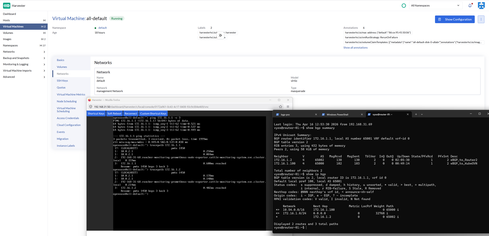
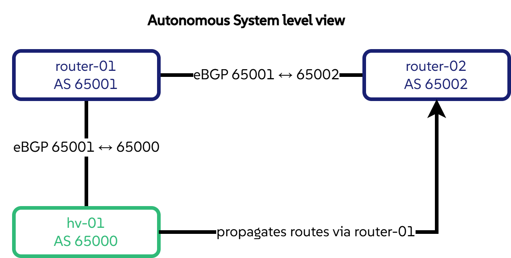
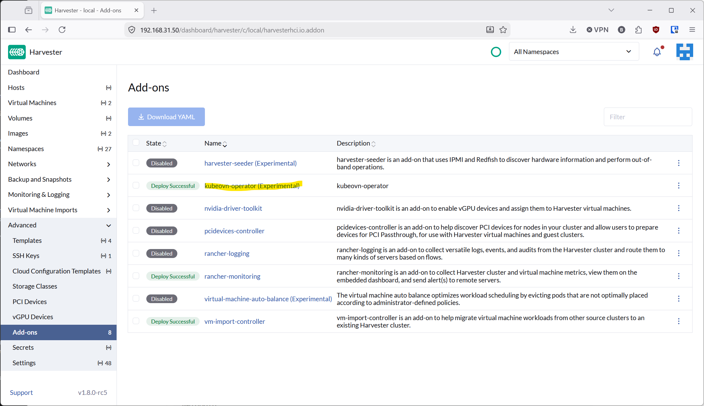
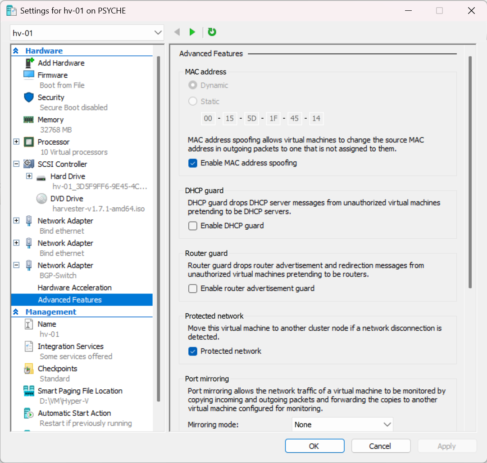
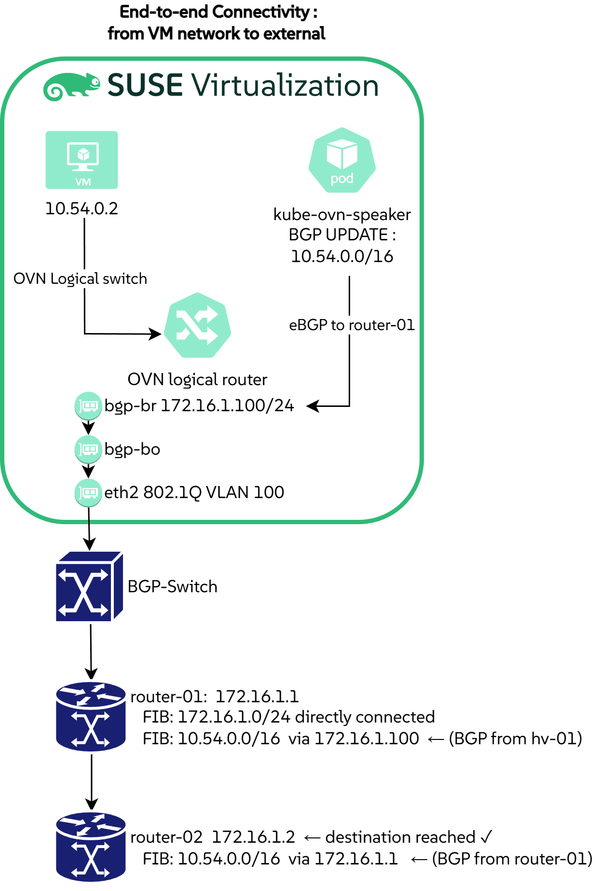

# BGP Route Advertisement with Kube-OVN on Harvester

In multi-tenant or hybrid environments, Kubernetes workloads (VMs, pods, and services) need to be reachable from the broader network.
The traditional answer is static routes scattered across every upstream router, which breaks as soon as the cluster grows or moves.
[BGP](https://en.wikipedia.org/wiki/Border_Gateway_Protocol){target="_blank"} :material-wikipedia: solves this cleanly : the cluster advertises its own CIDRs dynamically, and every router learns them automatically.

This post documents a proof-of-concept lab that validates BGP route propagation between [Kube-OVN](https://kube-ovn.io/){target="_blank"}'s built-in speaker, two [VyOS](https://vyos.io/){target="_blank"} :material-router: sagitta (1.4.x) routers, and a [Harvester](https://harvesterhci.io/){target="_blank"} :simple-suse: cluster, all running as Hyper-V VMs on a single Windows host. :material-microsoft-windows:

The end-state we are aiming for is a successful ping from `router-02` to a Kube-OVN pod IP, with every hop learned via BGP :



<!-- more -->

## The lab

Three nodes span three autonomous systems, and `router-02` reaches Kube-OVN prefixes transitively through `router-01` to validate multi-hop eBGP propagation :

| Node | Role | AS | BGP IP |
|---|---|---|---|
| `hv-01` | Harvester, Kube-OVN speaker, advertises the pod CIDR and annotated service IPs | 65000 | 172.16.1.100 |
| `router-01` | VyOS, direct peer with `hv-01` and `router-02` | 65001 | 172.16.1.1 |
| `router-02` | VyOS, learns Kube-OVN routes via `router-01` | 65002 | 172.16.1.2 |



BGP peering runs over a dedicated `172.16.1.0/24` network (VLAN 100), isolated from the management network, mirroring a realistic production design. All configuration files and manifests are in [github.com/coulof/bgp-poc](https://github.com/coulof/bgp-poc){target="_blank"} :simple-github:.

## Enabling Kube-OVN BGP on Harvester

Harvester ships Kube-OVN as an optional add-on.
Navigate to **Addons** in the Harvester UI and enable [**kubeovn-operator**](https://docs.harvesterhci.io/v1.7/advanced/addons/kubeovn-operator){target="_blank"} :simple-suse: to get Kube-OVN v1.15.4 with `--non-primary-cni-mode=true`.



Once enabled, verify that the core Kube-OVN pods are healthy before continuing :

```bash
kubectl -n kube-system get pods -l app=kube-ovn-controller
kubectl -n kube-system get pods -l app=ovs
kubectl get subnets.kubeovn.io
```

## Hyper-V prerequisites : two non-obvious settings

### VLAN trunking

Hyper-V drops 802.1Q-tagged frames by default.
Both VyOS routers use sub-interfaces (`eth1 vif 100`), and Harvester's Kube-OVN bridge expects tagged frames on VLAN 100.
The BGP-Switch adapter on every VM must be set to trunk mode :

```powershell
foreach ($vm in "router-01", "router-02", "hv-01") {
    Get-VMNetworkAdapter -VMName $vm |
        Where-Object { $_.SwitchName -eq "BGP-Switch" } |
        Set-VMNetworkAdapterVlan -Trunk -AllowedVlanIdList "100" -NativeVlanId 0
}
```

### MAC address spoofing

Harvester bridges `eth2` into an OVS bridge (`bgp-br`) with its own MAC address, different from the VM adapter.
Hyper-V's default security policy silently drops frames with a mismatched source MAC.
Enable spoofing on `hv-01`'s BGP adapter :

```powershell
Get-VMNetworkAdapter -VMName "hv-01" |
    Where-Object { $_.SwitchName -eq "BGP-Switch" } |
    Set-VMNetworkAdapter -MacAddressSpoofing On
```



!!! warning
    Both settings fail silently : the VM boots fine, BGP sessions stay in `Idle`, and no error message points at the hypervisor layer.

## Harvester BGP interface setup

Three CRDs configure the BGP peering interface on `hv-01` :

1. **`ClusterNetwork`** : declares a logical network (`bgp`) backed by `eth2`
2. **`VlanConfig`** : binds `eth2` as an active-backup bond ; Harvester automatically builds `eth2 → bgp-bo → bgp-br`
3. **`HostNetworkConfig`** : assigns `172.16.1.100/24` on VLAN 100 with cluster-managed persistence across reboots

```bash
kubectl apply -f clusternetwork.yaml -f vlanconfig.yaml -f hnc.yaml
```

Full manifests are in the [repository](https://github.com/coulof/bgp-poc){target="_blank"} :simple-github:.

!!! warning "Blocker"
    Do not proceed until L3 is confirmed from `hv-01` :

    ```bash
    ping -c3 172.16.1.1   # router-01
    ping -c3 172.16.1.2   # router-02
    ```

## Kube-OVN BGP speaker

Harvester's bundled Kube-OVN v1.15.4 does not include the `BgpConf` / `BgpPeer` CRDs.
BGP configuration goes through container args on the `kube-ovn-speaker` DaemonSet instead.

Label the node, deploy the speaker, then annotate the subnet to advertise :

```bash
kubectl label nodes hv-01 ovn.kubernetes.io/bgp=true
kubectl apply -f speaker.yaml
kubectl annotate subnet ovn-default ovn.kubernetes.io/bgp=true
```

!!! note "Single neighbor per speaker"
    A Kube-OVN speaker DaemonSet configured via container args accepts a single `--neighbor-as` value : a limitation of this deployment shape, not of BGP itself.
    The speaker here peers with `router-01` (AS 65001) ; `router-02` learns Kube-OVN routes transitively through `router-01`.
    A second speaker instance would be needed to open a direct session with `router-02` (AS 65002).
    Newer Kube-OVN releases ship `BgpConf` / `BgpPeer` CRDs that handle multiple neighbors natively.

The speaker advertises any subnet that carries the `ovn.kubernetes.io/bgp=true` annotation. In this lab that means a single prefix :

| Prefix | Source |
|---|---|
| `10.54.0.0/16` | Pod CIDR (`ovn-default` subnet) |

The DaemonSet also sets `--announce-cluster-ip=true`, which lets the speaker advertise individual service IPs (one `/32` per service) for any `Service` annotated with `ovn.kubernetes.io/bgp=cluster`. None are annotated in this PoC, so only the pod CIDR ends up in the RIB. The internal `join` subnet (`100.64.0.0/16`) is Kube-OVN plumbing and is never advertised.

## Validation

The diagram below traces a packet from a pod on `hv-01` all the way out to `router-02`, showing every hop where a BGP-learned route comes into play :



```bash
# On hv-01 - confirm what the speaker is announcing (and receiving)
kubectl -n kube-system exec -it \
    "$(kubectl -n kube-system get pod -l app=kube-ovn-speaker -o name | head -1)" \
    -- gobgp global rib

# On router-01 - Kube-OVN prefixes should appear via 172.16.1.100
show ip bgp

# On router-02 - same prefixes, next-hop via 172.16.1.1 (transitive)
show ip bgp

# End-to-end - from router-02, reach a pod IP directly
kubectl run nginx --image=nginx && kubectl get pods -o wide
ping <POD_IP>   # from router-02, proves full transitive propagation
```

## Conclusion

Once VLAN trunking and MAC spoofing are sorted on the Hyper-V side, Kube-OVN's BGP speaker on Harvester behaves like any other upstream BGP peer.

## Further reading

- [Kube-OVN BGP support](https://kube-ovn.readthedocs.io/zh-cn/latest/en/advance/with-bgp/){target="_blank"} :material-open-in-new:
- [VyOS BGP configuration guide (sagitta)](https://docs.vyos.io/en/sagitta/configuration/protocols/bgp.html){target="_blank"} :material-open-in-new:
- [Harvester networking deep-dive](https://docs.harvesterhci.io/v1.4/networking/deep-dive){target="_blank"} :simple-suse:
- [rrajendran17/KubeOVN-BGP](https://github.com/rrajendran17/KubeOVN-BGP){target="_blank"} :simple-github: : similar setup using FRR as the external router
